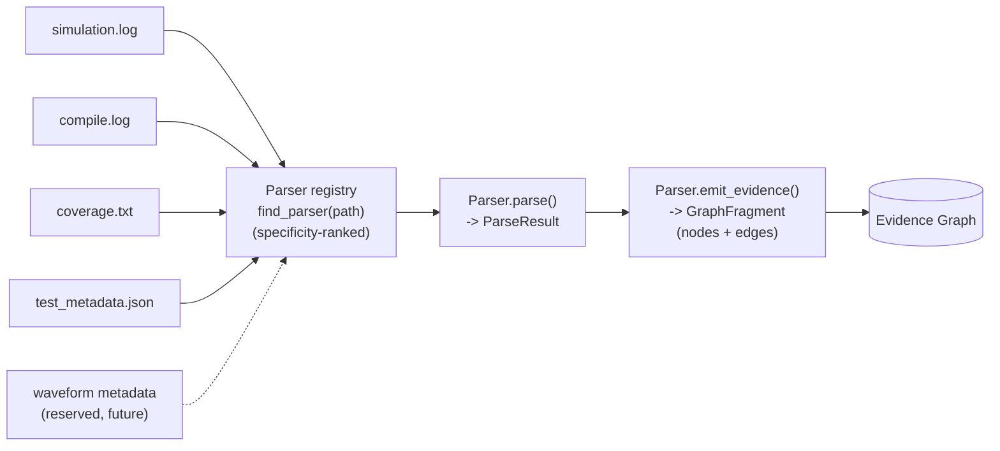
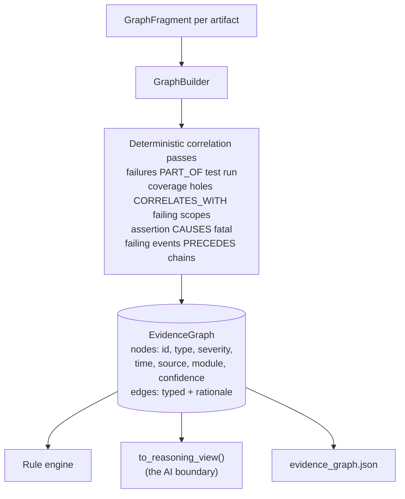
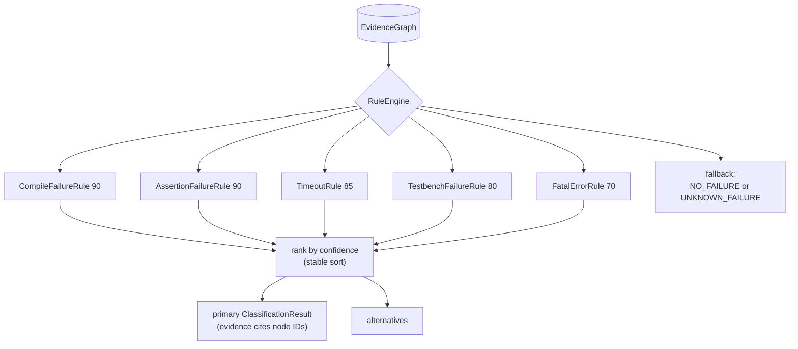
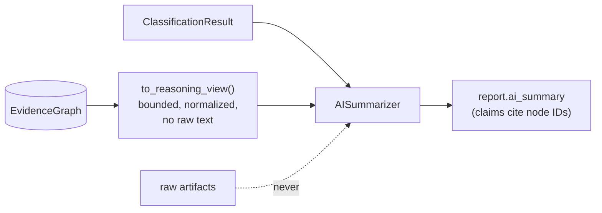

# VeriTriage Architecture

VeriTriage is a pipeline of small, replaceable layers. Data flows one way, every
layer speaks typed Pydantic models, and each extension point is a plugin
registry. Since v2 the layers meet in the middle at the **Evidence Graph**,
the single source of truth for everything downstream of parsing (full design
rationale: [EVIDENCE_GRAPH.md](EVIDENCE_GRAPH.md)).

## Parser pipeline

- **`veritriage.parsers.base.Parser`** is the single interface: `can_parse(path)`,
  `parse(path) -> ParseResult`, and `emit_evidence(result) -> GraphFragment`.
  The default `emit_evidence` covers message-oriented logs (and tags assertion
  failures as first-class `assertion` evidence); coverage and metadata parsers
  override it.
- **`veritriage.parsers.registry`** holds the plugin table. A new parser is a
  subclass with an `@register` decorator; no existing file changes. Pattern
  specificity ranking lets `compile.log` beat the generic `*.log` claim.
- Parsers are the only layer that ever touches raw artifact text.

## The Evidence Graph (single source of truth)

Node IDs are content hashes, so the same artifacts always produce the same
graph. Every edge carries a rationale; every node points to a file and line.

## Rule engine (graph-native)

- Rules are **pure functions of the graph**: no I/O, no randomness, no raw
  files. The same artifacts always classify identically.
- Each verdict's `Evidence` items carry `node_id` links into the graph, so
  every conclusion is mechanically traceable to artifact lines.
- Because rules query node types and attributes rather than file formats, new
  artifact types extend classification without engine changes (e.g. the
  compile rule fires on `compile_log` nodes from a dedicated compile log).

## Report layer

`AnalysisReport` (schema v2) carries the classification, merged run summary,
graph statistics, and evidence with node references. One analysis writes three
artifacts: `analysis.json`, `evidence_graph.json` (the full serialized graph),
and `report.html` (self-contained, light/dark aware, with an Evidence Graph
section). The CLI renders the same models to the terminal with Rich.

## AI layer

The AI reasons **only** over the graph's reasoning view plus the deterministic
classification. It runs strictly downstream: it cannot alter the graph, the
classification, or the evidence. `tests/test_ai_boundary.py` pins this
boundary. Adding artifact types therefore never requires changing the AI
reasoning engine; it just sees more nodes.

## Why v3+ needs no restructuring

| Future feature | Lands as |
|---|---|
| Assertion-log / richer coverage parsers | new `Parser` subclasses emitting fragments |
| Waveform metadata, FSDB/VCD indexing | parser for the reserved `waveform_metadata` type + a correlation pass |
| Spec retrieval, git correlation | new node types + correlation passes |
| Multi-agent / deeper AI reasoning | consumers of `to_reasoning_view()`, behind the same boundary |
| VS Code / Slack / GitHub Action / MCP server | front-ends over `veritriage.pipeline.analyze()` |

## Known limitations

- Single-line messages only (Questa's multi-line assertion context is ignored).
- Whole-file read into memory; fine for typical logs, streaming comes later.
- `INFO` events are counted but not turned into graph nodes, keeping the graph
  focused on diagnostic signal.
- Coverage parsing supports a simple `scope name : pct%` summary format.
