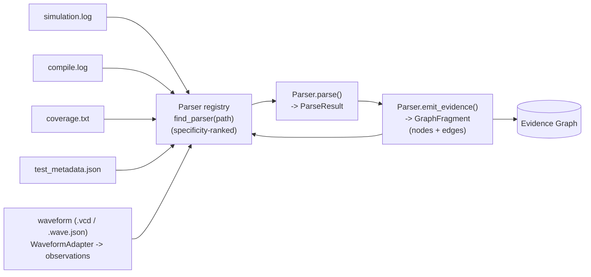
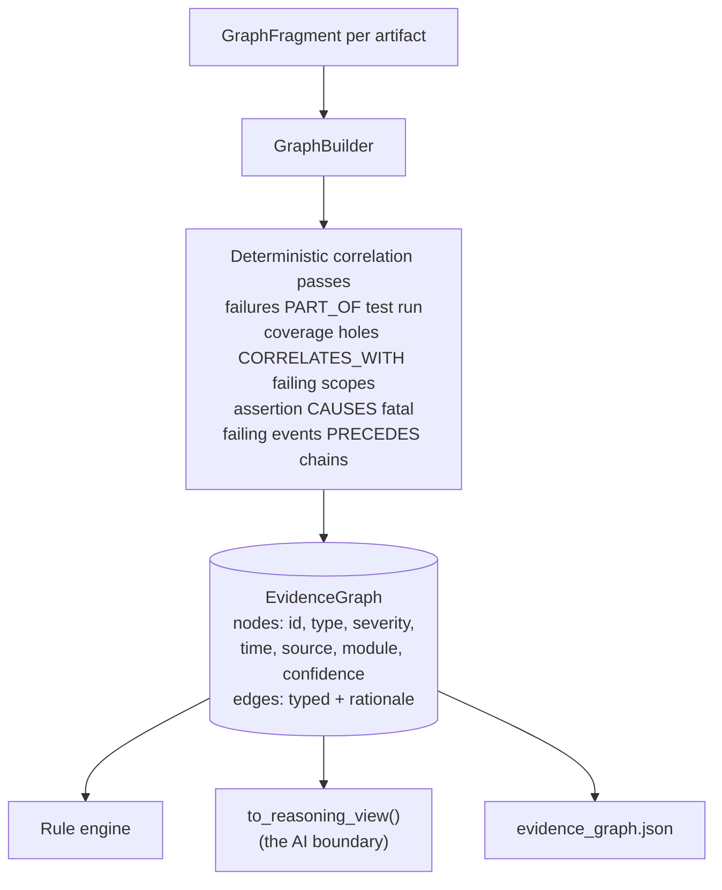
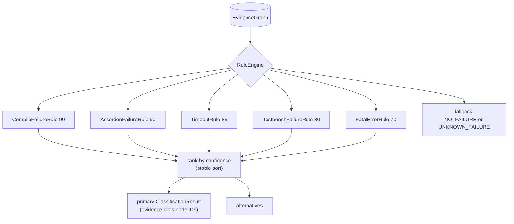
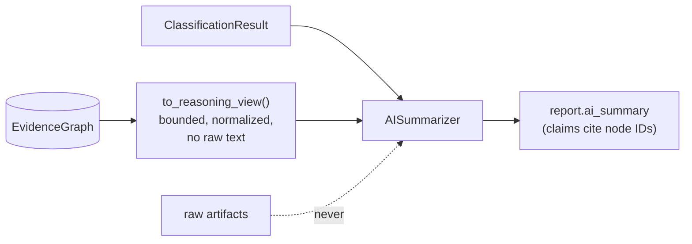

# VeriTriage Architecture

VeriTriage is a pipeline of small, replaceable layers. Data flows one way, every
layer speaks typed Pydantic models, and each extension point is a plugin
registry. Since v2 the layers meet in the middle at the **Evidence Graph**,
the single source of truth for everything downstream of parsing (full design
rationale: [EVIDENCE_GRAPH.md](EVIDENCE_GRAPH.md)).

## Parser pipeline

- **`veritriage.parsers.base.Parser`** is the single interface: `can_parse(path)`,
  `parse(path) -> ParseResult`, and `emit_evidence(result) -> GraphFragment`.
  The default `emit_evidence` covers message-oriented logs (and tags assertion
  failures as first-class `assertion` evidence); coverage and metadata parsers
  override it.
- **`veritriage.parsers.registry`** holds the plugin table. A new parser is a
  subclass with an `@register` decorator; no existing file changes. Pattern
  specificity ranking lets `compile.log` beat the generic `*.log` claim.
- Parsers are the only layer that ever touches raw artifact text.

## The Evidence Graph (single source of truth)

Node IDs are content hashes, so the same artifacts always produce the same
graph. Every edge carries a rationale; every node points to a file and line.

## Rule engine (graph-native)

- Rules are **pure functions of the graph**: no I/O, no randomness, no raw
  files. The same artifacts always classify identically.
- Each verdict's `Evidence` items carry `node_id` links into the graph, so
  every conclusion is mechanically traceable to artifact lines.
- Because rules query node types and attributes rather than file formats, new
  artifact types extend classification without engine changes (e.g. the
  compile rule fires on `compile_log` nodes from a dedicated compile log).

## Reasoning engine

Downstream of classification, the multi-stage reasoning pipeline
(`veritriage/reasoning/`) turns the graph into an investigation: evidence
selection -> deterministic signals -> competing hypothesis generation ->
ranking with traceable confidence propagation -> categorized recommendations,
with an optional AI review strictly after the deterministic stages. Full
design and diagrams: [REASONING_ENGINE.md](REASONING_ENGINE.md).

## Verification Knowledge Engine

Between classification and reasoning, the Knowledge Engine
(`veritriage/knowledge/`) matches structured domain expertise against the
Evidence Graph: 13 versioned Knowledge Packs (AXI, APB, AHB, CHI, TileLink,
PCIe, UVM, SVA, reset/clocking, CDC, cache coherency, RISC-V privilege,
coverage; 29 failure patterns, 29 playbooks, 9 protocol state machines in
total) normalize into a frozen, queryable Verification Knowledge Graph;
a deterministic clause matcher finds known failure patterns; evidence is
projected onto protocol state machines to show where progress stopped; and
matched patterns carry typical causes, ownership, suggested signals,
specification references, and fixed debug playbooks. Knowledge reaches
hypothesis ranking through the standard `ReasoningRule` interface (injected
by the pipeline), so the reasoning engine has no knowledge dependency and
new packs plug in without touching any existing code. Full design:
[KNOWLEDGE_ENGINE.md](KNOWLEDGE_ENGINE.md).

## Regression intelligence

Downstream of reasoning, the historical layer (`storage/`, `signatures/`,
`similarity/`, `history/`, `analytics/`, `feedback/`, `dashboard/`) records
every completed analysis into a persistent SQLite Regression Database,
fingerprints it with a deterministic Failure Signature, finds similar past
failures (signature match first, feature-embedding cosine second), and
augments the report with `HistoricalContext` plus at most one extra
precedent recommendation. Analytics and the `veritriage dashboard` command
aggregate the whole history (hotspots, clusters, trends). The reasoning
packages have no import path to any of this; history augments reasoning,
never modifies it (pinned by `tests/test_history.py`). Full design:
[REGRESSION_INTELLIGENCE.md](REGRESSION_INTELLIGENCE.md).

## Report layer

`AnalysisReport` (schema v5) carries the classification, merged run summary,
graph statistics, evidence with node references, the reasoning result, the
knowledge context, and optional historical context. One analysis writes
three artifacts: `analysis.json`, `evidence_graph.json` (the full
serialized graph), and `report.html` (self-contained, light/dark aware,
with Evidence Graph, Verification Knowledge, and Historical Context
sections). The CLI renders the same models to the terminal with Rich.

## AI layer

The AI reasons **only** over the graph's reasoning view plus the deterministic
classification. It runs strictly downstream: it cannot alter the graph, the
classification, or the evidence. `tests/test_ai_boundary.py` pins this
boundary. Adding artifact types therefore never requires changing the AI
reasoning engine; it just sees more nodes.

## Why v3+ needs no restructuring

| Future feature | Lands as |
|---|---|
| Assertion-log / richer coverage parsers | new `Parser` subclasses emitting fragments |
| A new waveform simulator (FSDB, FST, WLF, transaction DB) | one `WaveformAdapter` subclass, nothing else (see the two laws below) |
| A new engineering system (GitHub, GitLab, Perforce, Gerrit, Jenkins, Jira, DOORS) | one `ContextProvider` subclass, nothing else (see the M7 laws below) |
| Spec retrieval | new node types + correlation passes |
| New protocol/domain expertise (ACE, AXI-Stream, power management, security, formal, company-internal protocols, ...) | a Knowledge Pack module with `@register_pack` |
| Multi-agent / deeper AI reasoning | consumers of `to_reasoning_view()`, behind the same boundary |
| Jira / CI / emulation / formal integrations | adapters around the RegressionRecord vocabulary |
| Learned similarity embeddings | an `EmbeddingProvider` implementation in `similarity/` |
| VS Code / Slack / GitHub Action / MCP server | front-ends over `veritriage.pipeline.analyze()` |

## Waveform Intelligence (M6) and its two laws

The Waveform Intelligence Engine turns simulator-specific waveform artifacts
into normalized engineering observations (dead clock, stalled FSM, handshake
that never completed, transaction that never retired) that enter the Evidence
Graph as ordinary evidence. Format-aware code is quarantined in adapters; the
observation engine that draws conclusions is format-agnostic. Full design:
[WAVEFORM_ENGINE.md](WAVEFORM_ENGINE.md).

Two laws are permanent and each is pinned by a test in `tests/test_waveform.py`:

1. **Core-format isolation.** No component beyond a `WaveformAdapter` may
   reference a waveform format, parser, file extension, or simulator API. The
   Verification Intelligence Core operates exclusively on normalized metadata
   and evidence. (Pinned by `test_waveform_core_is_format_agnostic` and
   `test_reasoning_has_no_waveform_dependency`.)

2. **Lossy-by-design ingestion.** An adapter normalizes and discards; it never
   caches or exposes raw transitions. The contract is Raw -> Normalize ->
   Discard, so VeriTriage can never drift into being a waveform viewer.

The consequence, and the milestone's success criterion, is proven executably by
`test_new_simulator_needs_only_an_adapter`: a brand-new simulator reaches
evidence, reasoning, and the report by adding only an adapter class, with no
change to the Evidence Graph, reasoning, knowledge, regression, report, or AI
layers.

## Engineering Context (M7) and its two laws

The Engineering Context Engine answers "what changed?" before "what broke?":
pluggable providers (v1: local git, and a canonical JSON manifest any CI can
export) normalize commits, changed files, CI runs, ownership, and issues into
tool-independent context, which becomes ordinary evidence
(`ArtifactType.ENGINEERING_CHANGE`) correlated to failures and weighted into
hypothesis ranking through standard reasoning rules. Full design:
[ENGINEERING_CONTEXT_ENGINE.md](ENGINEERING_CONTEXT_ENGINE.md).

Two laws are permanent and each is pinned by a test in
`tests/test_engineering.py`:

1. **Core-tool isolation.** No component beyond a `ContextProvider` may
   reference Git, a hosting platform, a CI system, or any engineering-tool
   API or binary. Since M7, `history`'s `capture_execution_metadata`
   delegates to the git provider, so the law holds repo-wide with no
   grandfather clause. (Pinned by `test_no_git_outside_providers` and
   `test_engineering_core_is_tool_agnostic`.)

2. **Evidence, never conclusions.** Engineering context enters only as
   evidence nodes and evidence-cited signals; ownership informs
   recommendations only and never ranking (pinned by
   `test_ownership_never_reaches_ranking`), and the timeline/investigation
   views are pure projections of the Evidence Graph that never mutate it
   (pinned by `test_projections_do_not_mutate_the_graph`).

The success criterion is proven executably by
`test_new_system_needs_only_a_provider`: a brand-new engineering system
reaches evidence, correlation, reasoning, and the report by adding only a
provider class.

## Known limitations

- Single-line messages only (Questa's multi-line assertion context is ignored).
- Whole-file read into memory; fine for typical logs, streaming comes later.
- `INFO` events are counted but not turned into graph nodes, keeping the graph
  focused on diagnostic signal.
- Coverage parsing supports a simple `scope name : pct%` summary format.
