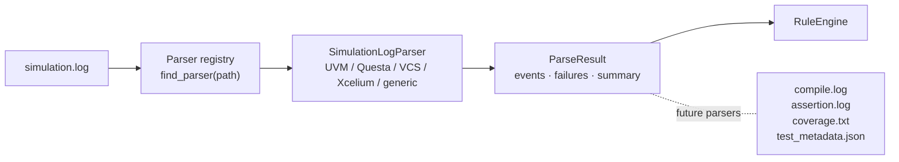
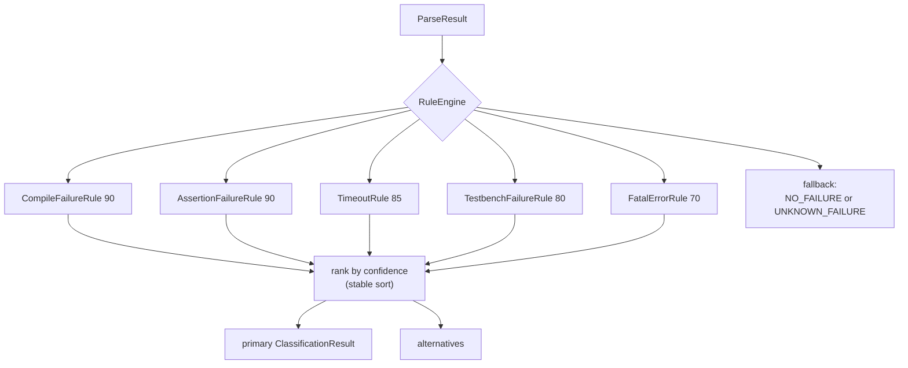
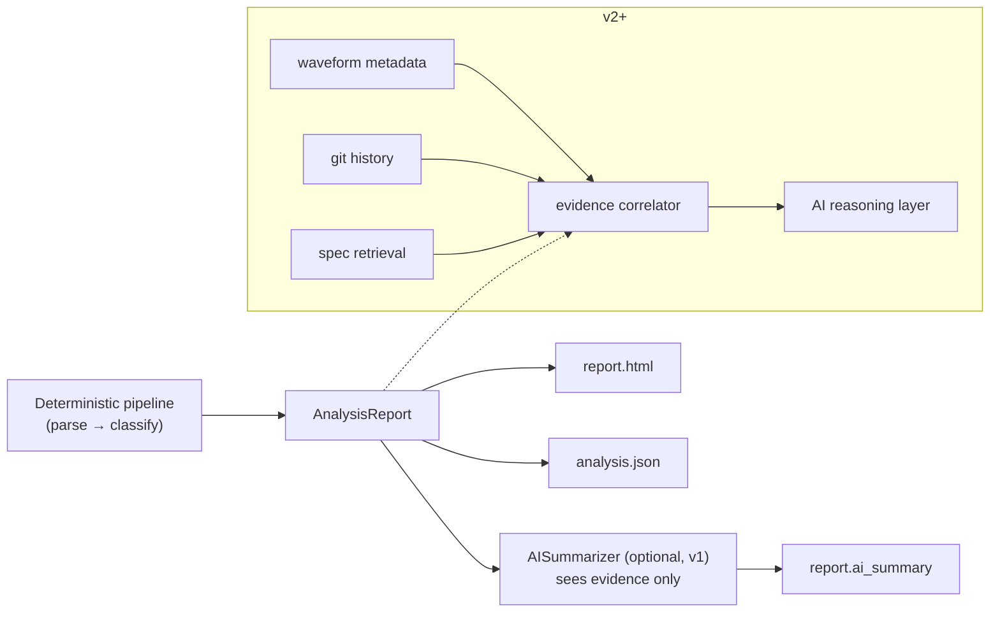

# TraceIQ Architecture

TraceIQ is a pipeline of small, replaceable layers. Data flows one way, every
layer speaks typed Pydantic models, and each extension point is a plugin
registry - so v2+ features (waveforms, coverage, AI reasoning) attach without
reshaping v1.

## Parser pipeline

- **`traceiq.parsers.base.Parser`** is the single interface: `can_parse(path)`
  plus `parse(path) -> ParseResult`.
- **`traceiq.parsers.registry`** holds the plugin table. A new parser is a
  subclass with an `@register` decorator - no existing file changes.
- **`ParseResult`** is the hand-off contract: normalized `SimulationEvent`s,
  extracted `Failure`/`AssertionFailure` records, and a `LogSummary`. Nothing
  downstream reads raw log text.

## Rule engine

- Rules are **pure functions** of the `ParseResult`: no I/O, no randomness. The
  same log always classifies identically.
- Each verdict is a `ClassificationResult`: category, confidence (0-100), the
  rule's name, `Evidence` items (each pointing at a log line), and
  `Recommendation`s (action + rationale).
- The engine guarantees a classification: if no rule fires it emits
  `NO_FAILURE` (clean log) or `UNKNOWN_FAILURE` (errors with no known
  signature).
- Confidence values are coarse and ordered so specific diagnoses outrank
  generic ones; ties resolve by registration order (deterministic).

## Report layer

`AnalysisReport` is the single output model, serialized verbatim to
`analysis.json` (schema-versioned) and rendered by `HtmlReportGenerator`
(Jinja2, autoescaped, self-contained HTML - no external assets, light/dark
theme aware). The CLI renders the same model to the terminal with Rich.

## Future AI layer

The AI boundary is the report model itself: any future reasoning layer consumes
`AnalysisReport` (plus new evidence sources) and writes back into it. Because
evidence is structured and location-anchored, AI output can always be audited
against the artifacts - the "no unsupported claims" rule is enforced by what
the AI is *given*, not by prompt hope alone.

## Why v2+ needs no restructuring

| Future feature | Lands as |
|---|---|
| Assertion / coverage / compile-log parsers | new `Parser` subclasses + `ParseResult` fields (additive) |
| Waveform metadata, FSDB/VCD indexing | new parser + new evidence source feeding existing `Evidence` |
| Spec retrieval, git correlation | new analyzers writing into `AnalysisReport` |
| Multi-agent / AI reasoning | consumers of `AnalysisReport`, behind the same evidence boundary |
| VS Code / Slack / GitHub Action / MCP server | front-ends over `traceiq.pipeline.analyze()` |

## Known v1 limitations

- Single-line messages only (Questa's multi-line assertion context is ignored).
- Whole-file read into memory; fine for typical logs, streaming comes later.
- `INFO` events are counted and available to rules but not serialized into
  `analysis.json` to keep it compact.
