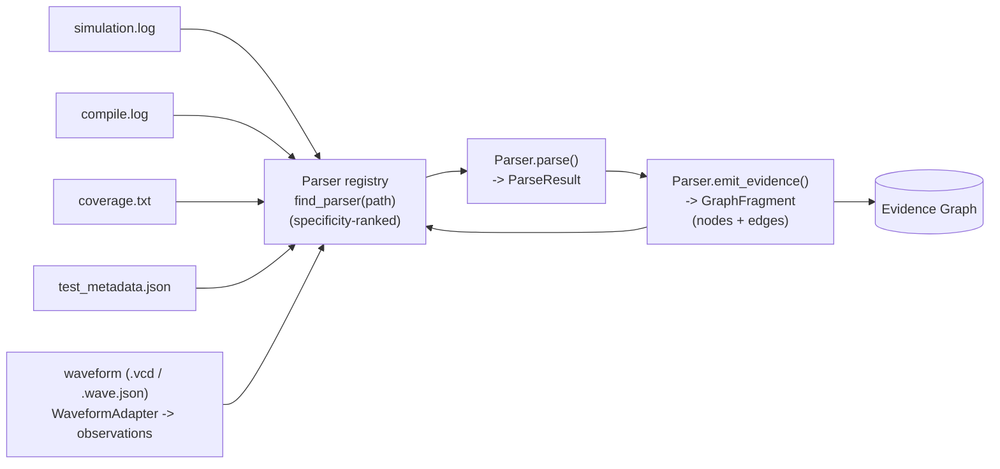
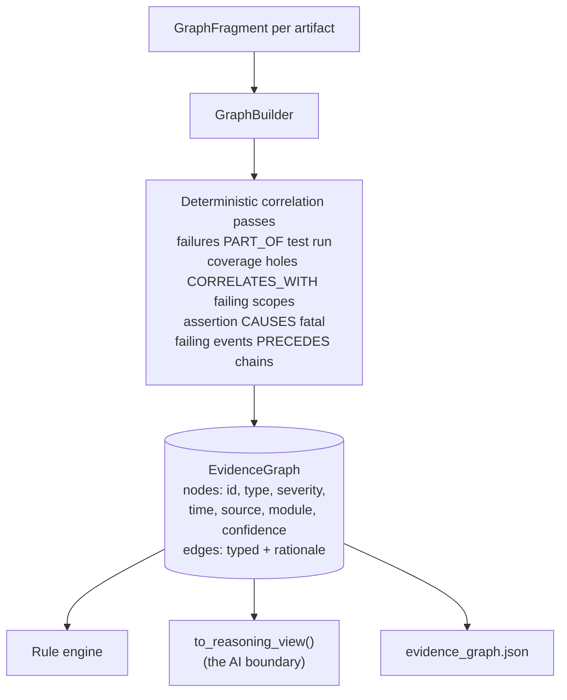
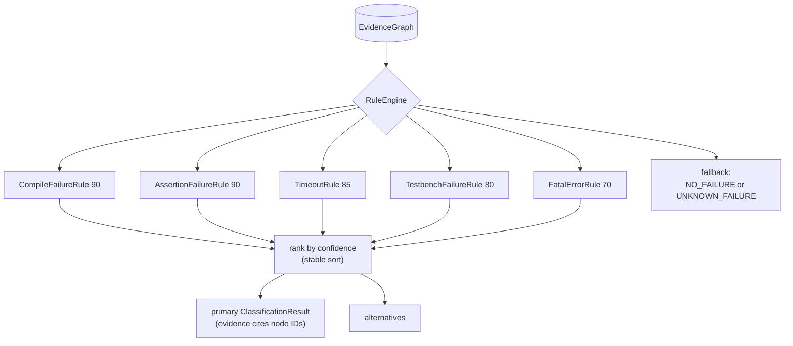
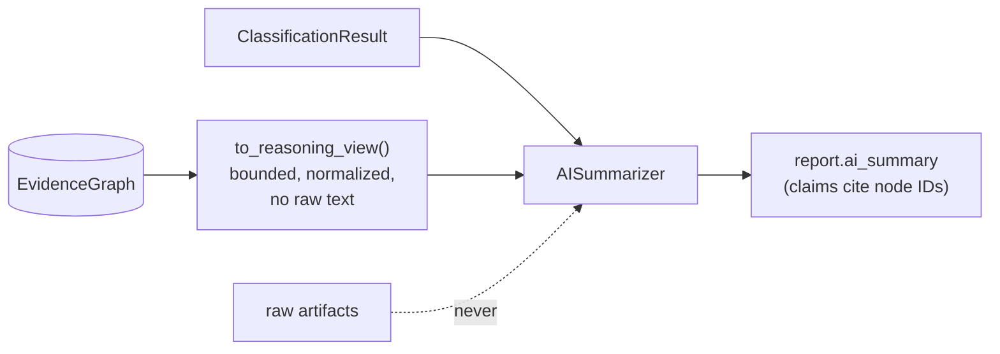

# VeriTriage Architecture

VeriTriage is a pipeline of small, replaceable layers. Data flows one way, every
layer speaks typed Pydantic models, and each extension point is a plugin
registry. Since v2 the layers meet in the middle at the **Evidence Graph**,
the single source of truth for everything downstream of parsing (full design
rationale: [EVIDENCE_GRAPH.md](EVIDENCE_GRAPH.md)).

## Parser pipeline

- **`veritriage.parsers.base.Parser`** is the single interface: `can_parse(path)`,
  `parse(path) -> ParseResult`, and `emit_evidence(result) -> GraphFragment`.
  The default `emit_evidence` covers message-oriented logs (and tags assertion
  failures as first-class `assertion` evidence); coverage and metadata parsers
  override it.
- **`veritriage.parsers.registry`** holds the plugin table. A new parser is a
  subclass with an `@register` decorator; no existing file changes. Pattern
  specificity ranking lets `compile.log` beat the generic `*.log` claim.
- Parsers are the only layer that ever touches raw artifact text.

## The Evidence Graph (single source of truth)

Node IDs are content hashes, so the same artifacts always produce the same
graph. Every edge carries a rationale; every node points to a file and line.

## Rule engine (graph-native)

- Rules are **pure functions of the graph**: no I/O, no randomness, no raw
  files. The same artifacts always classify identically.
- Each verdict's `Evidence` items carry `node_id` links into the graph, so
  every conclusion is mechanically traceable to artifact lines.
- Because rules query node types and attributes rather than file formats, new
  artifact types extend classification without engine changes (e.g. the
  compile rule fires on `compile_log` nodes from a dedicated compile log).

## Reasoning engine

Downstream of classification, the multi-stage reasoning pipeline
(`veritriage/reasoning/`) turns the graph into an investigation: evidence
selection -> deterministic signals -> competing hypothesis generation ->
ranking with traceable confidence propagation -> categorized recommendations,
with an optional AI review strictly after the deterministic stages. Full
design and diagrams: [REASONING_ENGINE.md](REASONING_ENGINE.md).

## Verification Knowledge Engine

Between classification and reasoning, the Knowledge Engine
(`veritriage/knowledge/`) matches structured domain expertise against the
Evidence Graph: 42 versioned Knowledge Packs across six domains (interconnect,
CPU/ISA, memory, serial IO, coherency, methodology; 92 failure patterns, 90
playbooks, 15 protocol state machines in total) normalize into a frozen,
queryable Verification Knowledge Graph;
a deterministic clause matcher finds known failure patterns; evidence is
projected onto protocol state machines to show where progress stopped; and
matched patterns carry typical causes, ownership, suggested signals,
specification references, and fixed debug playbooks. Knowledge reaches
hypothesis ranking through the standard `ReasoningRule` interface (injected
by the pipeline), so the reasoning engine has no knowledge dependency and
new packs plug in without touching any existing code. Full design:
[KNOWLEDGE_ENGINE.md](KNOWLEDGE_ENGINE.md).

## Regression intelligence

Downstream of reasoning, the historical layer (`storage/`, `signatures/`,
`similarity/`, `history/`, `analytics/`, `feedback/`, `dashboard/`) records
every completed analysis into a persistent SQLite Regression Database,
fingerprints it with a deterministic Failure Signature, finds similar past
failures (signature match first, feature-embedding cosine second), and
augments the report with `HistoricalContext` plus at most one extra
precedent recommendation. Analytics and the `veritriage dashboard` command
aggregate the whole history (hotspots, clusters, trends). The reasoning
packages have no import path to any of this; history augments reasoning,
never modifies it (pinned by `tests/test_history.py`). Full design:
[REGRESSION_INTELLIGENCE.md](REGRESSION_INTELLIGENCE.md).

## Report layer

`AnalysisReport` (schema v13) carries the classification, merged run summary,
graph statistics, evidence with node references, the reasoning result, the
knowledge context, the waveform, engineering, and project contexts, the agent
assessment, the learning context, the design context, the investigation
plan, the automation context, and optional historical context. One analysis writes
three artifacts: `analysis.json`, `evidence_graph.json` (the full
serialized graph), and `report.html` (self-contained, light/dark aware,
with Evidence Graph, Verification Knowledge, Agent Findings, What Prior
Investigations Suggest, Design Intelligence, Recommended Investigation, and
Historical Context sections). The CLI renders the same models to the terminal with Rich.

## AI layer

The AI reasons **only** over the graph's reasoning view plus the deterministic
classification. It runs strictly downstream: it cannot alter the graph, the
classification, or the evidence. `tests/test_ai_boundary.py` pins this
boundary. Adding artifact types therefore never requires changing the AI
reasoning engine; it just sees more nodes.

## Why v3+ needs no restructuring

| Future feature | Lands as |
|---|---|
| Assertion-log / richer coverage parsers | new `Parser` subclasses emitting fragments |
| A new waveform simulator (FSDB, FST, WLF, transaction DB) | one `WaveformAdapter` subclass, nothing else (see the two laws below) |
| A new engineering system (GitHub, GitLab, Perforce, Gerrit, Jenkins, Jira, DOORS) | one `ContextProvider` subclass, nothing else (see the M7 laws below) |
| A new client or API endpoint (VS Code, Cursor, internal tools) | a `WorkspaceServices` consumer or one MCP tool via `register_tool`, nothing else (M8) |
| A new investigation workflow step or profile | one `register_step` / `register_profile` call, nothing else (M9) |
| A new annotation target kind (collaboration) | one `register_annotation_target` call, nothing else (M10) |
| Spec retrieval | new node types + correlation passes |
| New protocol/domain expertise (ACE, AXI-Stream, power management, security, formal, company-internal protocols, ...) | a Knowledge Pack module with `@register_pack` |
| A new domain specialist (thermal, power, emulation, company-internal) | one `register_agent` class, nothing else (M12) |
| A new AI provider (Claude, GPT, Gemini, local, MCP-hosted) | one `ReasoningProvider` implementation, nothing else (M12) |
| A new thing to learn from history (flakiness, cost, cycle time) | one `register_learner` class, nothing else (M13) |
| Learned embeddings, semantic retrieval, graph similarity | an `EmbeddingProvider` or a `Learner`; the Learning Engine contracts are unchanged (M13) |
| A new kind of debug step (emulation, lab bring-up, silicon) | one `register_source` class, nothing else (M14) |
| Interactive planning, live debugging, CI investigation, tool execution | consumers of `DebugPlan`; planning stays advisory (M14) |
| A new structural facet (power domains, ports, FSMs, packages) | one `register_extractor` class, nothing else (M15) |
| Cross-probing, IDE hierarchy, waveform navigation, semantic search | clients over `DesignQuery`; node IDs are stable and citable (M15) |
| A new kind of question | one `register_handler` class, nothing else (M16) |
| GPT, Claude, Gemini, local models, voice, Slack, IDE copilots | translators producing `Question` objects and rendering `Answer` objects (M16) |
| OpenAI, Anthropic, Google, local models, MCP-hosted providers, enterprise gateways | one `LLMProvider` class plus one `register_llm_provider` call (M17) |
| A new thing to react to | one `register_trigger` class plus one `register_rule` call (M18) |
| GitHub Actions, Jenkins, GitLab, Slack, VS Code, enterprise schedulers | event producers and action-request consumers; automation is unchanged (M18) |
| Jira / CI / emulation / formal integrations | adapters around the RegressionRecord vocabulary |
| Learned similarity embeddings | an `EmbeddingProvider` implementation in `similarity/` |
| VS Code / Slack / GitHub Action / MCP server | front-ends over `veritriage.pipeline.analyze()` |

## Waveform Intelligence (M6) and its two laws

The Waveform Intelligence Engine turns simulator-specific waveform artifacts
into normalized engineering observations (dead clock, stalled FSM, handshake
that never completed, transaction that never retired) that enter the Evidence
Graph as ordinary evidence. Format-aware code is quarantined in adapters; the
observation engine that draws conclusions is format-agnostic. Full design:
[WAVEFORM_ENGINE.md](WAVEFORM_ENGINE.md).

Two laws are permanent and each is pinned by a test in `tests/test_waveform.py`:

1. **Core-format isolation.** No component beyond a `WaveformAdapter` may
   reference a waveform format, parser, file extension, or simulator API. The
   Verification Intelligence Core operates exclusively on normalized metadata
   and evidence. (Pinned by `test_waveform_core_is_format_agnostic` and
   `test_reasoning_has_no_waveform_dependency`.)

2. **Lossy-by-design ingestion.** An adapter normalizes and discards; it never
   caches or exposes raw transitions. The contract is Raw -> Normalize ->
   Discard, so VeriTriage can never drift into being a waveform viewer.

The consequence, and the milestone's success criterion, is proven executably by
`test_new_simulator_needs_only_an_adapter`: a brand-new simulator reaches
evidence, reasoning, and the report by adding only an adapter class, with no
change to the Evidence Graph, reasoning, knowledge, regression, report, or AI
layers.

## Engineering Context (M7) and its two laws

The Engineering Context Engine answers "what changed?" before "what broke?":
pluggable providers (v1: local git, and a canonical JSON manifest any CI can
export) normalize commits, changed files, CI runs, ownership, and issues into
tool-independent context, which becomes ordinary evidence
(`ArtifactType.ENGINEERING_CHANGE`) correlated to failures and weighted into
hypothesis ranking through standard reasoning rules. Full design:
[ENGINEERING_CONTEXT_ENGINE.md](ENGINEERING_CONTEXT_ENGINE.md).

Two laws are permanent and each is pinned by a test in
`tests/test_engineering.py`:

1. **Core-tool isolation.** No component beyond a `ContextProvider` may
   reference Git, a hosting platform, a CI system, or any engineering-tool
   API or binary. Since M7, `history`'s `capture_execution_metadata`
   delegates to the git provider, so the law holds repo-wide with no
   grandfather clause. (Pinned by `test_no_git_outside_providers` and
   `test_engineering_core_is_tool_agnostic`.)

2. **Evidence, never conclusions.** Engineering context enters only as
   evidence nodes and evidence-cited signals; ownership informs
   recommendations only and never ranking (pinned by
   `test_ownership_never_reaches_ranking`), and the timeline/investigation
   views are pure projections of the Evidence Graph that never mutate it
   (pinned by `test_projections_do_not_mutate_the_graph`).

The success criterion is proven executably by
`test_new_system_needs_only_a_provider`: a brand-new engineering system
reaches evidence, correlation, reasoning, and the report by adding only a
provider class.

## Workspace & MCP (M8): the core becomes a service

As of M8 the Verification Intelligence Core is considered stable and
feature-complete in *shape* (packs, adapters, and providers still grow
through their registries). Access happens through the workspace:
`WorkspaceServices` is the single public API, the immutable
`InvestigationSession` (report + graph + deterministic identity) is the
canonical exchange object, and the CLI and the MCP server
(`veritriage mcp`, stdio JSON-RPC) are peer clients of the same services.
Every report section is individually addressable through
`workspace.navigation` without regenerating anything. Full design:
[WORKSPACE_PLATFORM.md](WORKSPACE_PLATFORM.md).

The dependency law, pinned by `tests/test_workspace.py`: dependencies point
outward only. `workspace/` and `mcp/` import the core; no core package
imports them (`test_no_engine_knows_workspace`), the CLI and MCP share
services and never import the pipeline directly
(`test_cli_and_mcp_share_services`, AST-verified), sessions are immutable,
the public API never exposes raw parser/adapter/provider objects, and a new
endpoint is one registered tool (`test_new_endpoint_needs_only_a_tool`).

## Investigation Orchestrator (M9): explicit workflows over the services

Investigations are explicit, immutable, serializable Investigation Plans
built from registered profiles (`veritriage run <profile>`, or the
`run_investigation` MCP tool) and executed by a deterministic engine (Kahn
order, sorted frontier, retries, failure isolation with SKIPPED dependents
and surviving independent branches). Every run produces an Execution Trace:
per-step status, timing, artifact flow, and per-subsystem attribution
(which signals and recommendations came from knowledge, waveform,
engineering, history, ownership, or the built-in rules), embedded in the
persisted session. The orchestrator schedules and observes; it never
concludes: it can import only the workspace and the models vocabulary
(`test_orchestrator_never_bypasses_services`, AST-verified), nothing below
imports it (`test_core_unchanged_by_orchestration`), and a new workflow
step or profile is one registration
(`test_new_step_needs_only_registration`). Full design:
[INVESTIGATION_ORCHESTRATOR.md](INVESTIGATION_ORCHESTRATOR.md).

## Agent Framework (M12): specialized reasoning above deterministic reasoning

Eight domain specialists (protocol, RTL, testbench, coverage, regression,
formal, project, knowledge) each form an independent, evidence-backed position
over the finished deterministic result, and an Agent Coordinator merges them
into ranked findings with agreement, conflict, and per-agent contribution made
explicit. Generative intelligence is a declared seam (`ReasoningProvider`) that
may narrate a conclusion but never create one, so adding Claude, GPT, Gemini, a
local model, or an MCP-hosted reasoner is one class behind one protocol, with no
change to the Coordinator or to any agent. Full design:
[AGENT_FRAMEWORK.md](AGENT_FRAMEWORK.md).

The load-bearing law, pinned by `tests/test_agents.py`: **agents form a second
opinion, never a replacement verdict.** The Coordinator reads the
`ReasoningResult` and records whether it agrees
(`test_agents_never_mutate_reasoning_or_graph` proves the graph, the
classification, and the deterministic hypotheses are byte-identical with agents
on or off). Agents are handed normalized evidence and never a path, so they
cannot read a raw artifact (`test_agents_never_read_raw_artifacts`); every
citation is filtered against the real graph
(`test_fabricated_citations_are_filtered_out`); an agent with nothing to cite
abstains; a rogue provider that tries to rewrite hypotheses changes only prose
(`test_provider_cannot_alter_conclusions`); and a new specialist is one
registration (`test_new_agent_needs_only_registration`).

## Learning Engine (M13): the platform stops being stateless

Every completed investigation improves the next one, without retraining
anything and without touching a deterministic conclusion path. The Learning
Engine (`veritriage/learning/`) consumes the regression database and engineer
feedback and derives seven families of versioned, explainable artifacts
(recurring investigation patterns, evidence combinations, agent reliability,
project profiles, protocol statistics, recommendation outcomes, hypothesis
history), then recalls them for the next run as hints and a bounded agent
calibration map. Full design: [LEARNING_ENGINE.md](LEARNING_ENGINE.md).

The load-bearing law, pinned by `tests/test_learning.py`: **learning is a pure
function of recorded history.** Given the same records and feedback, the
artifacts are byte-identical, independent of arrival order and of the wall
clock (artifact timestamps come from the newest recorded run, never from
`now()`). Three consequences follow, each test-pinned: learning never overrides
deterministic evidence (`test_learning_never_changes_graph_or_reasoning`);
learning is removable, since deleting the separate learning database restores
exact pre-M13 behavior
(`test_platform_without_learning_matches_previous_behaviour`); and nothing is
opaque, since no LLM, embedding, vector database, or model appears anywhere in
the package (`test_no_models_or_embeddings_in_learning`).

Calibration is the one place learning touches ranking, and it is bounded on
three sides: a floor on evidence before it applies at all, a narrow clamp on
the multiplier, and a default of nothing. It is applied by the Coordinator at
merge time, never by an agent, so an agent still computes the same position
from the same evidence and only its influence moves
(`test_calibration_never_changes_what_an_agent_concluded`). Agents gain memory
without gaining a dependency: hints arrive as plain data on `AgentContext`, and
`agents/` never imports `learning/`
(`test_agents_gain_memory_without_importing_learning`).

## Planning Engine (M14): from explaining failures to planning investigations

The last intelligence layer, and the only one that answers "what should happen
next?" rather than "what is true?". The Planner (`veritriage/planning/`)
consumes the finished report and derives a `DebugPlan`: steps ordered by value
against effort, decision points that branch on competing explanations, the
evidence still missing and why it matters, completion conditions, and stated
risks. Full design: [PLANNING_ENGINE.md](PLANNING_ENGINE.md).

The load-bearing law, pinned by `tests/test_planning.py`: **the Planner
contributes structure, never content.** Every step is derived from an artifact
that already exists (a knowledge playbook step, an agent recommendation, a
reasoning recommendation, or an evidence gap) and names it in `derived_from`
(`test_every_step_is_derived_from_an_existing_artifact`,
`test_playbook_steps_keep_their_curated_wording`). Sources cannot rank
themselves: `StepCandidate` has no priority field, so valuation and ordering
belong to the Planner alone (`test_a_source_cannot_rank_itself`).

Planning consumes conclusions without changing them: the graph, the
classification, the reasoning hypotheses, and the agent assessment are
identical with planning on or off
(`test_planning_never_changes_upstream_conclusions`), and
`reasoning.recommendations` survives untouched. Planning never executes: no
I/O, no subprocess, no tool invocation anywhere in the package
(`test_planning_never_executes_anything`). Branching stays deterministic
because `AUTO` decision conditions are settled by evidence already in the
graph, while `ASK` conditions are rendered as open questions and left standing
(`test_evidence_already_in_the_graph_resolves_a_decision`).

The vocabulary is deliberately separate from M9 orchestration: an
`InvestigationPlan` is what the platform runs, a `DebugPlan` is what the
engineer does (`test_planning_does_not_collide_with_m9_orchestration`).

## Design Intelligence (M15): the platform understands the system

The third graph in the platform. The Evidence Graph says what happened in one
run; the Knowledge Graph says what is generally true of a protocol; the
**Design Graph** (`veritriage/design/`) says what this system *is*: modules,
IP blocks, interfaces, clock and reset domains, address regions, register
blocks, UVM components, VIPs, coverage and assertion groups, joined by fourteen
typed relationships. Full design:
[DESIGN_INTELLIGENCE.md](DESIGN_INTELLIGENCE.md).

The load-bearing law, pinned by `tests/test_design.py`: **the Design Graph is
derived, never extracted.** `design/` performs no source reading at all
(`test_design_never_reads_source`) and imports no provider
(`test_design_never_imports_a_provider`). It normalizes the M11 Project Model
into a queryable graph, resolving every dangling string (`DesignModule.parent`,
`ClockDomain.roots`, `UvmComponent.interface`, `AddressRegion.target_ip`) into a
real edge. If a structural fact is missing, the fix is a `ProjectProvider`, not
a new parser, and M11's law that only a provider reads source stays exactly
where it was (`test_project_package_unchanged`).

This is the M1 to M2 transition repeated: M1's parsers produced flat
`ParseResult`s and M2 added the Evidence Graph as the relational layer over
them without re-parsing. M15 does the same for project structure.

Every edge names the project-model field it came from
(`test_every_edge_carries_a_rationale`), and the few edges that follow
hierarchy rather than a declaration are marked `inferred`
(`test_inference_is_declared_not_hidden`). The graph never enters the Evidence
Graph (`test_design_never_enters_the_evidence_graph`), partial models yield
smaller graphs rather than errors, and a new structural facet is one
registration (`test_new_extractor_needs_only_registration`).

## Conversation Engine (M16): the intelligence becomes navigable

The last layer, and the only one that owns no intelligence at all. The
Conversation Engine (`veritriage/conversation/`) turns a finished investigation
into something an engineer can interrogate: structured questions, answers
assembled from artifacts that already exist, navigation state that carries
between turns, and suggested follow-ups that make movement possible without
parsing prose. Full design: [CONVERSATION_ENGINE.md](CONVERSATION_ENGINE.md).

The load-bearing law, pinned by `tests/test_conversation.py`: **conversation
navigates; it never concludes.** Asking any number of questions leaves the
report and the graph byte-identical
(`test_conversation_never_mutates_the_session`), every citation resolves to a
real artifact (`test_every_reference_resolves_to_a_real_artifact`), and the
engine strips any that does not rather than trusting a handler
(`test_unresolvable_citations_are_stripped_by_the_engine`).

Questions are structured objects. A deterministic parser maps a declared,
finite vocabulary onto intents and reports an honest miss when a phrase falls
outside it (`test_out_of_vocabulary_declares_what_it_understands`), because
guessing at meaning is the one thing this layer must never do. There is no
language model, no NLP library, and no generated prose
(`test_no_ai_in_conversation`); a future LLM becomes a translator producing
`Question` objects and rendering `Answer` objects, never an owner of either.

Nothing is persisted: a `ConversationSession` is serializable and handed back to
the caller, because navigation state is not intelligence and does not belong in
a store (`test_conversation_persists_nothing`). And `conversation/` never
imports `workspace/`: the workspace exposes conversation, not the reverse
(`test_conversation_never_imports_the_workspace`).

## Generative AI (M17): providers render, never reason

The only layer permitted to produce text that was not computed. `ai/` owns
provider integration and no verification intelligence: a provider receives a
frozen `Prompt` built from cited platform objects and returns prose. Full
design: [AI_PROVIDERS.md](AI_PROVIDERS.md).

**One vendor registry, not two.** M12's `agents.ReasoningProvider` is frozen and
agent-shaped, so it cannot carry summaries or design walkthroughs. Rather than
build a parallel registry, `ai.adapters.LlmReasoningProvider` satisfies the M12
interface by delegating to an `LLMProvider`, so registering a vendor once serves
both agent narration and every renderer
(`test_reasoning_provider_bridges_to_one_registry`,
`test_the_m12_contract_is_untouched`).

The load-bearing law, pinned by `tests/test_ai.py`: **providers render, never
reason.** Generation cannot change a conclusion
(`test_generation_never_changes_conclusions`); a provider's entire input is a
frozen prompt with no platform handles
(`test_providers_receive_no_platform_handles`); `ai/` performs no file I/O
(`test_ai_never_reads_raw_artifacts`); and a provider that fails, raises, or
exceeds its prompt budget costs prose and nothing else
(`test_a_failing_provider_costs_only_prose`).

**Grounding is enforced, not requested.** The prompt declares its citation set;
any citation outside it is stripped from the response with the omission
recorded, tested against a deliberately hostile provider
(`test_invented_citations_are_stripped`). Prompt construction is a pure function
of the structured input and fully inspectable before generation
(`test_prompts_are_inspectable_before_generation`), so what a provider will be
asked is auditable without asking it.

Generation is off by default (the `null` provider), and no built-in provider
calls an external API. `conversation/` remains AI-free: it produces the
structured answer, and `ai/` renders it (`test_conversation_stays_ai_free`).

## Automation Engine (M18): the platform reacts

The layer that makes VeriTriage event-driven. `automation/` publishes the
moments the platform already detects, evaluates declarative triggers against
them, fires structured rules, and emits `ActionRequest` objects. Full design:
[AUTOMATION_ENGINE.md](AUTOMATION_ENGINE.md).

The load-bearing decision, forced by two facts: M9's orchestrator already owns
execution (its ten registered steps are almost exactly the proposed action
list), and `orchestrator/` imports `workspace/`, so an automation layer that
executed would sit above the orchestrator and could not then be consumed by the
workspace without a cycle. Therefore:

**Automation decides; it never executes.** `automation/` imports only `models`
(`test_automation_imports_only_models`), performs no I/O and imports no
scheduler, subprocess, socket, or thread (`test_automation_never_executes_
anything`), and emits requests that the **workspace** dispatches to methods it
already has. The action vocabulary is a closed enum, so "actions never execute
arbitrary code" is structural rather than policy
(`test_actions_are_a_closed_vocabulary`), and rules carry no executable content
(`test_rules_carry_no_executable_content`).

Events are immutable, ordered, and content-addressed
(`test_events_are_immutable`, `test_sequence_is_monotonic`,
`test_event_ids_are_content_derived`), because replay, ordering, and audit are
only meaningful if the log cannot have changed since it was written. The bus is
synchronous with no threads, queues, or hidden callbacks; a broken subscriber is
isolated (`test_a_broken_subscriber_never_breaks_publish`); and replay
reproduces identical decisions without rewriting history
(`test_replay_reproduces_the_same_decisions`).

Automation never changes a conclusion: the classification, hypotheses, and plan
are identical with it on or off (`test_automation_never_changes_the_report`),
because `report.automation` is appended by the workspace after `analyze()`
returns, exactly as historical context is.

## Collaborative Investigation Platform (M10): portable investigations

An investigation becomes a portable, reviewable, reproducible engineering
artifact: the immutable session wrapped in a versioned, content-addressed,
integrity-fingerprinted Investigation Bundle (`.vtb`) that also carries the
collaboration layer (reviews and annotations that sit on top of the session
and never touch it). An engineer exports a bundle, hands it to another with no
access to the original regression environment, and they import, review,
annotate against real object IDs, validate by fingerprint, compare with an
explanation of what changed, and continue investigating from the imported
session. Bundles contain only normalized platform objects, never a raw
waveform or log file. Full design:
[COLLABORATION_PLATFORM.md](COLLABORATION_PLATFORM.md).

Pinned by `tests/test_collaboration.py`: bundles are deterministic and their
export/import round-trip is lossless; reviews and annotations never mutate the
session or affect reasoning; validation is reproducible and catches tampering
(fingerprint) and dangling references; `collab/` imports only the workspace
and models (AST-verified) and no core package imports it; and a new annotation
type is one `register_annotation_target` call
(`test_new_annotation_target_needs_only_registration`).

## v1.0.0: the core is stable

Ten milestones landed additively without breaking a prior one, every
extension point is registry-shaped and test-pinned, and the public surface -
`WorkspaceServices`, the MCP tool table, the orchestrator's step/profile
registries, and the `.vtb` bundle format - is now declared stable. Future
work is integrations and ecosystem adoption over these seams, not core
expansion.

## Known limitations

- Single-line messages only (Questa's multi-line assertion context is ignored).
- Whole-file read into memory; fine for typical logs, streaming comes later.
- `INFO` events are counted but not turned into graph nodes, keeping the graph
  focused on diagnostic signal.
- Coverage parsing supports a simple `scope name : pct%` summary format.
