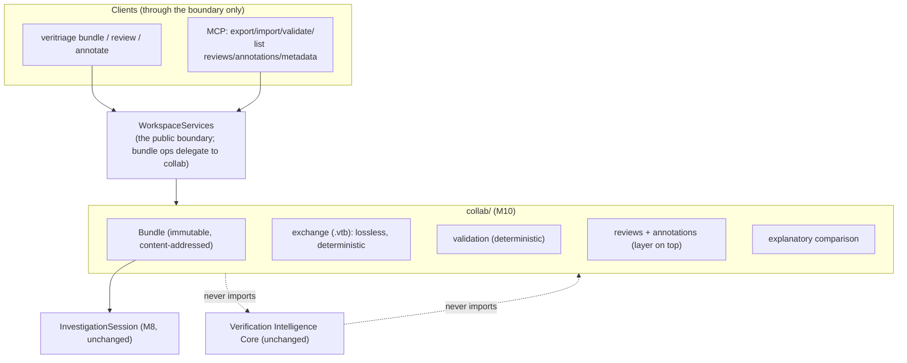

# Collaborative Investigation Platform (Milestone 10)

Status: IMPLEMENTED in v1.0.0. This began as the design contract for M10
(reviewed and approved before any Python was written) and is now the
milestone's permanent architecture doc. The three review decisions are folded
in: M10 ships as v1.0.0 (the platform's public API is now declared stable),
bundles include per-node `raw_line` provenance (self-contained, losslessly
equal to the live session), and the collaboration code is one consolidated
`collab/` package.

---

## 1. The one-sentence thesis

An investigation becomes a portable, reviewable, reproducible engineering
document: the immutable Investigation Session, wrapped in a versioned,
content-addressed, integrity-checked **Investigation Bundle** that also carries
the collaboration layer (reviews and annotations that sit on top of the session
and never touch it), so one engineer can export a complete investigation, hand
it to another with no access to the original regression environment, and have
them import it, review it, annotate it, validate it, and continue it - all
without a single change to the Verification Intelligence Core.

## 2. Why this is small (the platform already did the hard part)

The session is already immutable, content-addressed, and fully normalized: it
carries the report (classification, reasoning, knowledge, waveform,
engineering, history), the Evidence Graph, and, since M9, the plan and trace.
Everything required to understand a regression already travels in one object,
and it already contains only normalized platform objects - never a raw
waveform or a multi-gigabyte log file.

So M10 does not re-serialize the platform. A bundle is a thin, versioned
envelope: `session + reviews + annotations + metadata`, with a content-derived
ID and an integrity fingerprint. Reviews and annotations are the genuinely new
data, and they are deliberately *outside* the session (they layer on top), so
the core thesis holds: the session an engineer receives is byte-for-byte the
session that was produced, and collaboration never rewrites a conclusion.

## 3. Architecture and package layout

The spec names `bundle/, review/, annotation/, validation/, exchange/` as
example packages. Following the M8 and M9 precedent you approved, M10
consolidates into **one** cohesive package with one module per concern (every
named capability is a module; splitting later is mechanical):

```
collab/
  __init__.py       public surface; importing registers built-in annotation targets
  model.py          Bundle, BundleMetadata, Review, Annotation, enums (all frozen)
  exchange.py       export/import: deterministic serialization + gzip (.vtb)
  validation.py     deterministic bundle verification -> ValidationResult
  review.py         review verdicts + add_review (returns a new bundle)
  annotation.py     annotation targets + @register_annotation_target + add_annotation
  comparison.py     structured, explanatory bundle diff
```



Dependency law, test-pinned: `collab/` imports only `veritriage.workspace`
(the session type) and `veritriage.models` (report submodels) plus stdlib. No
engine, parser, provider, adapter, or the pipeline is importable there. No
existing subsystem imports `collab/`. **WorkspaceServices remains the public
boundary**: its bundle methods reach `collab` through lazy imports (exactly as
it already lazily reaches storage, history, and reports), so clients touch only
services and there is no import-time coupling. CLI and MCP never import
`collab` directly (guard-enforced).

## 4. The Bundle (`model.py`)

```python
class ReviewVerdict(str, Enum):
    APPROVED, NEEDS_INVESTIGATION, INCORRECT_DIAGNOSIS,
    INCOMPLETE_EVIDENCE, FALSE_POSITIVE

class Review(BaseModel):            # frozen
    id: str                          # deterministic: verdict + reviewer + comment + ordinal
    verdict: ReviewVerdict
    reviewer: str
    comment: str
    created_at: datetime

class Annotation(BaseModel):        # frozen
    id: str                          # deterministic content hash
    target_type: str                 # a registered annotation-target kind
    target_id: str                   # an ID that must exist in the session
    author: str
    text: str
    created_at: datetime

class BundleMetadata(BaseModel):    # frozen
    session_id: str
    classification: str
    veritriage_version: str
    created_at: datetime
    exported_by: str | None
    fingerprint: str                 # sha256 of the canonical bundle payload
    title: str | None

class InvestigationBundle(BaseModel):   # frozen, extra="allow" (forward-compat)
    schema_version: str = "1"
    bundle_id: str                   # content-derived (see below)
    session: InvestigationSession    # the whole investigation, unchanged
    reviews: tuple[Review, ...]
    annotations: tuple[Annotation, ...]
    metadata: BundleMetadata
```

* **Content-derived ID.** `bundle_id = "vtb-" + sha1(session_id, sorted review
  IDs, sorted annotation IDs, schema_version)[:12]`: the same session with the
  same collaboration layer is the same bundle, byte for byte. Adding a review
  or annotation yields a new bundle with a new ID (immutability preserved).
* **Fingerprint (integrity).** `metadata.fingerprint = sha256` of the bundle's
  canonical JSON with the fingerprint field itself blanked, so validation can
  recompute and compare. Tamper with any byte of the session, a review, or an
  annotation and the fingerprint no longer verifies.
* **Immutable.** Frozen model; `add_review`/`add_annotation` return a *new*
  bundle via `model_copy`, never mutate. The embedded session is never touched
  by either.

## 5. Bundle format and exchange (`exchange.py`)

* **Deterministic serialization.** Pydantic preserves field order and the
  upstream objects are already deterministic, so `model_dump_json` is
  reproducible. Export canonicalizes (sorted map keys) before hashing and
  writing.
* **Compression.** The canonical JSON is gzipped with `mtime=0` so the bytes
  are deterministic, written as a single `.vtb` file (VeriTriage Bundle). A
  plain-JSON mode (`--no-compress`) is available for diff-friendly review.
* **Lossless round-trip.** `import_bundle(export_bundle(bundle)) == bundle`,
  and the recovered session equals the original session
  (`test_export_import_is_lossless`). No raw waveform or log file is embedded;
  only the normalized session travels. (Per-evidence-node `raw_line`
  provenance - a single captured log line already in the graph - travels as
  part of the normalized evidence, exactly as it does in a live session; see
  the review question on this.)
* **Schema versioning + forward compatibility.** The bundle carries
  `schema_version`; the model allows unknown fields (`extra="allow"`) so a
  bundle written by a newer VeriTriage imports without data loss on an older
  one, and validation reports unknown extensions as warnings, never errors.

## 6. Reviews (`review.py`)

A review is a structured verdict (`APPROVED`, `NEEDS_INVESTIGATION`,
`INCORRECT_DIAGNOSIS`, `INCOMPLETE_EVIDENCE`, `FALSE_POSITIVE`) plus a comment,
reviewer, and timestamp. `add_review(bundle, verdict, reviewer, comment)`
returns a new bundle with the review appended; the session, its report, and its
reasoning are untouched (`test_reviews_never_affect_reasoning`). Reviews are
metadata that layer on top: a reviewer disagreeing with a diagnosis records
`INCORRECT_DIAGNOSIS`, they do not edit the hypothesis.

## 7. Annotations (`annotation.py`)

An annotation is an immutable record pinned to an existing object by ID:
`target_type` + `target_id` + author + text. Every annotation must reference a
real object in the session; validation rejects dangling targets.

**Extensibility (the crown-jewel seam).** Annotation target kinds are a
registry: `@register_annotation_target(kind, resolver)`, where the resolver
answers "does this target_id exist in this session?". The v1 kinds:

| target_type | resolves against |
| --- | --- |
| `evidence` | an Evidence Graph node ID |
| `knowledge-pattern` | a matched pattern ID |
| `waveform-observation` | a waveform observation ID |
| `engineering-commit` | an engineering commit revision |
| `recommendation` | a recommendation index |
| `execution-step` | a trace step ID |

A new annotation type (say `coverage-hole`) is one `register_annotation_target`
call plus a resolver: no change to the bundle model, validation, exchange, or
Workspace (`test_new_annotation_target_needs_only_registration`).

## 8. Explanatory comparison (`comparison.py`)

Beyond M8's signature-and-classification `compare`, M10 explains *what changed*
between two bundles across every layer, each as added / removed / changed with
specifics:

| Facet | Diff content |
| --- | --- |
| classification | old vs new category and confidence |
| evidence | failing-evidence descriptions added / removed |
| knowledge | matched pattern IDs added / removed |
| waveform | observation kinds added / removed |
| engineering | changed-module and correlated-failure deltas |
| recommendations | recommendation actions added / removed |
| execution trace | steps and statuses added / removed / changed |
| metadata | version, reviewer verdicts, annotation counts |

The result is a `BundleComparison` model whose top line is a human sentence
("same failure signature; 2 new waveform observations; diagnosis changed from
testbench to RTL"), not a boolean. Deterministic: same pair, same explanation.

## 9. Validation (`validation.py`)

`validate_bundle(bundle) -> ValidationResult(ok, errors, warnings)`, fully
deterministic. Checks:

* **Schema compatibility** - major version understood; newer minor is a
  warning, not an error.
* **Integrity / fingerprint** - recomputed canonical hash equals
  `metadata.fingerprint`.
* **Referential integrity** - every annotation `target_id` resolves through
  its registered target kind; every graph edge references nodes that exist;
  every hypothesis and signal cites nodes present in the graph.
* **Broken relationships** - reasoning working-set and cited evidence exist.
* **Unknown extensions** - `extra` fields present -> warnings (forward-compat,
  never fatal).
* **Metadata consistency** - `metadata.session_id` matches the embedded
  session; `bundle_id` recomputes correctly.

`ValidationResult` is a typed model (severity-tagged findings), so the CLI, the
report, and MCP all render the same verdict.

## 10. Report additions

The HTML report gains a "Collaboration" section (bundle metadata, fingerprint,
review status, annotations grouped by target, and validation results),
rendered via the same additive side-channel M9 used for metrics: an optional
`collaboration=` argument on `HtmlReportGenerator.render`, plain data built by
`collab`, so the reports package stays ignorant of bundle internals and reports
without a bundle are byte-identical. **No `AnalysisReport` schema change**: the
collaboration layer lives in the bundle, not the report, so the report model
(v7) is untouched and sessions still wrap it unchanged.

## 11. WorkspaceServices additions (the boundary) and CLI / MCP

New service methods (each lazily importing `collab`, keeping services the
boundary):

`export_bundle(session, path, ...) -> Path`, `import_bundle(path) ->
InvestigationBundle` (and `save` its session so the investigation can
continue), `validate_bundle(path_or_bundle) -> ValidationResult`,
`review_bundle(path, ...) -> InvestigationBundle`, `annotate_bundle(path, ...)
-> InvestigationBundle`, `compare_bundles(a, b) -> BundleComparison`.

CLI (all through services):

* `veritriage bundle export <session-id> -o inv.vtb`
* `veritriage bundle import inv.vtb` (loads the session into the workspace)
* `veritriage bundle validate inv.vtb`
* `veritriage bundle compare a.vtb b.vtb`
* `veritriage review inv.vtb --verdict approved --reviewer asha --comment "..."`
* `veritriage annotate inv.vtb --target evidence:ev-... --author diego --text "..."`

MCP tools (thin, over services): `export_investigation`, `import_investigation`,
`validate_bundle`, `compare_bundles`, `list_reviews`, `list_annotations`,
`get_bundle_metadata`.

## 12. Testing

Unit: bundle ID and fingerprint determinism; export/import round-trip
losslessness (bundle and recovered session); gzip byte-determinism; each review
verdict; annotation add + dangling-target rejection; every built-in annotation
resolver; validation on a clean bundle, a tampered bundle (fingerprint fails),
a dangling annotation, and an unknown-extension bundle (warns, still ok); the
explanatory comparison across two genuinely different investigations; the
report collaboration section renders.

Architecture guards:

* `test_bundles_are_deterministic` - same session + collab layer -> identical
  bytes;
* `test_export_import_is_lossless` - round-trip equals the original bundle and
  session;
* `test_annotations_never_mutate_sessions` - the session inside a bundle is
  unchanged before/after annotate/review (deep compare);
* `test_reviews_never_affect_reasoning` - the report's reasoning is identical
  after any number of reviews;
* `test_bundle_validation_is_reproducible` - same bundle -> same
  ValidationResult, byte for byte;
* `test_collab_never_bypasses_services` - AST: `collab` imports only workspace
  + models; CLI/MCP never import `collab`;
* `test_core_unchanged_by_collaboration` - no core/workspace/orchestrator
  package imports `collab`;
* **crown jewel, `test_new_annotation_target_needs_only_registration`** - a
  throwaway annotation target kind registered inside the test validates and
  round-trips through export/import with zero changes to the bundle model,
  validation, exchange, or Workspace.

## 13. Out of scope for M10 (deliberately)

* A bundle *server* or registry (bundles are portable files; sharing is
  copy/send, matching "no access to the original environment").
* Merge/conflict resolution across divergent bundles (comparison explains
  differences; merging is a future concern).
* Real-time multi-user editing; collaboration is asynchronous and
  append-only, which is what makes it immutable and reproducible.
* Encryption or signing beyond the integrity fingerprint (bundles are
  engineering artifacts, not secrets; signing is a future extension point).

## 14. On v1.0

The milestone completes the collaboration story you outlined and, with it, the
platform's original vision: analyze, reason, know, remember, see the waveform,
see what changed, expose as a service, orchestrate, and now share. The
architecture has absorbed nine additive milestones without breaking a prior
one, and every extension point is registry-shaped and test-pinned. This is the
natural place to freeze the version. Whether M10 ships *as* v1.0.0, or as
v0.10.0 with a dedicated stabilization pass to follow, is the one product
decision this design leaves open (see the review questions).

## 15. Success criteria (from the milestone spec, as tests)

An engineer can export a complete investigation to a portable `.vtb` bundle,
another can import it on a different machine with no access to the original
simulation outputs, review it, annotate it against real object IDs, validate
its integrity by fingerprint, compare it against another investigation with an
explanation of what changed, and continue investigating from the imported
session - all through Workspace Services, with the Verification Intelligence
Core unchanged (guard-extended), collaboration never mutating a session or a
conclusion, and a new annotation type requiring exactly one registration.
