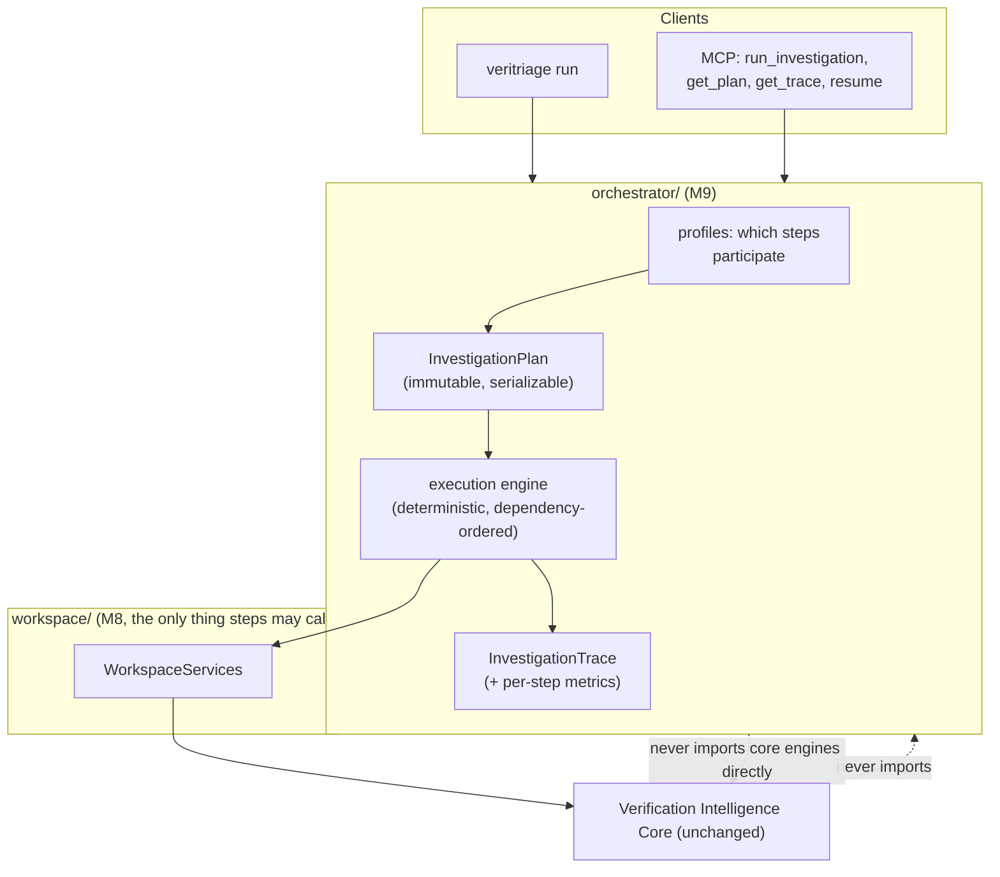

# Investigation Orchestrator (Milestone 9)

Status: IMPLEMENTED in v0.9.0. This began as the design contract for M9
(reviewed and approved before any Python was written) and is now the
milestone's permanent architecture doc. Two adjustments were made during
implementation, both documented inline below: the plan/trace data models
live in ``veritriage/models/orchestration.py`` (the layer-neutral vocabulary
package, so the session can reference them while the workspace stays below
the orchestrator), and the ``regression-analysis`` profile ships without a
``compare-to-precedent`` step in v1 (historical matches carry regression
IDs, not session IDs, so a session-to-session comparison step needs a
precedent-session mapping that does not exist yet; ``services.compare``
remains available directly).

---

## 1. The one-sentence thesis

The orchestrator turns an investigation from an implicit call sequence into
an explicit, immutable, serializable **Investigation Plan** executed by a
deterministic engine that composes existing Workspace Services and records a
complete **Execution Trace** (what ran, what it produced, who consumed it,
how long it took, which subsystem each conclusion came from), without adding
a single line of reasoning and without touching the Verification
Intelligence Core.

## 2. Why orchestration is separate from reasoning

Reasoning answers "what broke and why?"; orchestration answers "what work
should this investigation do, in what order, and what happened when it ran?".
Keeping them apart preserves the platform's core law: every technical
conclusion is produced by the deterministic intelligence stack. The
orchestrator schedules and observes; it never concludes, weighs, or ranks.
If the orchestrator disappeared tomorrow, every conclusion would be
unchanged; only the workflow bookkeeping (plans, traces, metrics) would go.

## 3. The one hard design decision: step granularity is the service boundary

The milestone's example step list includes stages like "Run Knowledge
Matching" and "Rank Hypotheses". Those stages already execute inside
`pipeline.analyze()` in a fixed, architecture-test-pinned order: that
internal sequence IS the platform's core guarantee (knowledge and waveform
and engineering signals feed ranking through one rule interface, exactly
once, deterministically). Re-exposing them as independently schedulable
steps would force one of two forbidden moves:

* duplicate the pipeline's composition inside the orchestrator ("the
  orchestrator should never duplicate reasoning"), or
* dismantle the core's entry point into orchestrator-driven fragments
  ("the Verification Intelligence Core remains unchanged").

So M9 orchestrates at the **service boundary**: the deterministic
intelligence pipeline is one atomic step (`analyze-artifacts`), and every
other step is another Workspace Services call (context gathering, historical
lookup, timeline, report rendering, persistence, layer summaries). What the
spec's fine-grained examples actually want - per-subsystem visibility - is
delivered by the **trace**, not by fragmenting execution: after the analyze
step, the trace attributes results per subsystem by reading the session
(signals by rule-name prefix: `knowledge:`, `waveform:`, `engineering:`;
recommendations by their documented rationale sources: reasoning,
history precedent, ownership routing). Deterministic attribution, no
re-execution, no duplication.

## 4. Architecture and package layout

The spec names `orchestrator/, plans/, steps/, execution/, metrics/, trace/`
as example packages. Following the approved M8 precedent, M9 consolidates
into **one** package with one module per concern (every named capability
exists as a module; splitting later is mechanical):

```
orchestrator/
  __init__.py    public surface; importing registers built-in steps/profiles
  model.py       InvestigationPlan, PlanStep, StepStatus, InvestigationTrace,
                 StepTrace, StepMetrics (frozen where the spec demands)
  steps.py       InvestigationStep ABC + @register_step + the built-in steps
  profiles.py    InvestigationProfile + @register_profile + the six built-ins
  engine.py      the deterministic execution engine
```



Dependency law, test-pinned: `orchestrator/` imports **only**
`veritriage.workspace` (plus its own modules and `veritriage.models` for
typed artifacts). It never imports the pipeline, parsers, engines, providers,
or adapters: the orchestrator cannot bypass Workspace Services even by
accident, because the modules it would need are unimportable by guard.

## 5. Investigation Plans (`model.py`)

```python
class PlanStep(BaseModel):            # frozen
    id: str                            # step instance id within the plan
    step_type: str                     # registered step name
    depends_on: tuple[str, ...]        # plan-step ids
    inputs: tuple[str, ...]            # artifact names consumed
    outputs: tuple[str, ...]           # artifact names produced
    max_retries: int = 0
    params: dict[str, Any]             # per-profile step parameters

class InvestigationPlan(BaseModel):   # frozen, serializable
    plan_id: str                       # deterministic: profile + step ids + input names
    profile: str
    created_for: tuple[str, ...]       # artifact paths / session id
    steps: tuple[PlanStep, ...]        # declaration order; engine derives execution order
```

A plan is built from a profile before execution and never mutated: execution
status lives in the **trace**, not the plan, so "the plan is a serializable
artifact" and "immutable" hold simultaneously (a plan with mutable statuses
would be neither).

## 6. Investigation Profiles (`profiles.py`)

A profile is a named, registered composition of step instances. Profiles
select which services participate; they contain zero reasoning logic and
change nothing in how any service behaves.

| Profile | Steps (beyond `analyze-artifacts` -> `persist-session`) |
| --- | --- |
| `fast-triage` | nothing else: analyze, summarize, persist. The minimal loop. |
| `full-investigation` | gather-context before; historical-lookup, build-timeline, render-report after |
| `regression-analysis` | analyze records history (param `record_history=true`); historical-lookup |
| `protocol-debug` | knowledge-review step (matched patterns + playbooks artifact); render-report |
| `waveform-focused` | waveform-review step (observations + capability gaps artifact); render-report |
| `infrastructure-review` | gather-context; engineering-review step (CI/environment slice); historical-lookup |
| `engineering-review` | gather-context; engineering-review; build-timeline |

(Seven ship: the spec's six plus `full-investigation` as the everything-on
reference. Each is a handful of declarative `PlanStep`s; `@register_profile`
is the extension point.)

## 7. Steps (`steps.py`)

```python
class InvestigationStep(ABC):
    step_type: ClassVar[str]
    default_inputs: ClassVar[tuple[str, ...]]
    default_outputs: ClassVar[tuple[str, ...]]
    @abstractmethod
    def run(self, services: WorkspaceServices, context: dict[str, Any],
            params: dict[str, Any]) -> dict[str, Any]: ...
```

Steps read named artifacts from the execution context and return the
artifacts they produce; the engine owns all wiring, timing, and status. The
v1 step library (every one a thin `WorkspaceServices` call):

| Step type | Service call | Produces |
| --- | --- | --- |
| `gather-context` | `services.gather_engineering_context(root)` (new, additive) | `engineering_context` |
| `analyze-artifacts` | `services.investigate(paths, engineering, record_history?)` | `session` |
| `summarize` | `services.summary(session)` | `summary` |
| `historical-lookup` | `services.similar_regressions(session)` | `similar` |
| `knowledge-review` | `services.matched_patterns(session)` + playbook slice | `knowledge_review` |
| `waveform-review` | `services.waveform_observations(session)` + gaps | `waveform_review` |
| `engineering-review` | `services.engineering_context(session)` | `engineering_review` |
| `build-timeline` | `services.timeline(session)` | `timeline` |
| `render-report` | `services.render_report(session, out_dir, metrics)` (new, additive) | `report_path` |
| `persist-session` | `services.save(session_with_trace)` | `session_path` |

Two additive `WorkspaceServices` methods appear (`gather_engineering_context`
wrapping the provider registry's `collect_context`, and `render_report`
wrapping the HTML generator): the workspace is the platform's own growing
surface, and both methods immediately benefit MCP clients too. Nothing in
the core changes.

`@register_step` is the plugin seam: a future contributor implements a step
class, registers it, references it from a profile, and touches nothing else
(`test_new_step_needs_only_registration`, the crown jewel, proves it with a
throwaway step + custom profile executed by the real engine).

## 8. The execution engine (`engine.py`)

Deterministic and boring, on purpose:

* **Ordering:** Kahn's topological sort with the ready set processed in
  sorted-id order: dependency-correct, independent steps deterministically
  interleaved, and the same plan always executes in the same order.
  (This is also the seam for future asynchronous execution: the ready set
  is exactly the parallelizable frontier; a future async engine dispatches
  it concurrently without any step changing.)
* **Failure isolation:** a step that raises is retried up to its
  `max_retries`, then marked FAILED; its transitive dependents become
  SKIPPED with the blocking step named; independent branches continue.
  Partial completion is a first-class outcome, visible in the trace.
* **Timing:** wall-clock per attempt (`perf_counter`), recorded per step
  plus a total. Timings are observability, not identity: trace *structure*
  (steps, order, statuses, artifacts, attribution) is deterministic and
  test-compared; durations are excluded from determinism guarantees.
* **Statuses:** PENDING -> RUNNING -> COMPLETED | FAILED | SKIPPED.
* No AI anywhere; no threads in v1.

## 9. The Investigation Trace (`model.py`)

```python
class StepTrace(BaseModel):           # frozen
    step_id: str; step_type: str
    status: StepStatus
    attempts: int
    duration_ms: float | None          # observability, not identity
    consumed: tuple[str, ...]          # artifact names read
    produced: tuple[str, ...]          # artifact names written
    evidence: tuple[str, ...]          # e.g. session id, report path, counts
    note: str | None                   # failure reason / skip cause

class SubsystemAttribution(BaseModel):  # frozen
    subsystem: str                     # "rules", "knowledge", "waveform",
                                       # "engineering", "history", "ownership"
    signals: tuple[str, ...]           # signal names it contributed
    recommendations: int               # steps it contributed to next-steps

class InvestigationTrace(BaseModel):  # frozen
    plan_id: str; profile: str
    steps: tuple[StepTrace, ...]       # execution order
    attribution: tuple[SubsystemAttribution, ...]
    total_duration_ms: float | None
    completed: bool                    # every step COMPLETED
```

The trace answers the spec's questions directly: which services executed
(steps), which evidence was produced (produced/evidence), who consumed each
artifact (consumed), how long each step took (duration_ms), and which
recommendations originated from which subsystem (attribution, computed
deterministically from the session's signal prefixes and recommendation
rationales).

**The trace becomes part of the session** via one additive optional field on
`InvestigationSession` (`trace: InvestigationTrace | None = None`, plus
`plan: InvestigationPlan | None = None`), attached with `model_copy` so the
frozen contract holds: the orchestrator produces a *new* session object with
the trace embedded; `session_id` is unchanged because identity derives from
report + graph, never from workflow bookkeeping. Sessions from plain
`services.investigate` simply carry `None`, so nothing in M8 behavior moves.

## 10. Observability in the report

`render_report` passes the trace's per-step metrics to the HTML generator as
plain data (`HtmlReportGenerator.render(..., metrics=...)`, an additive
optional parameter plus one template block: "Investigation performance").
The reports package stays ignorant of the orchestrator: it renders a dict of
labeled durations, imported from nowhere. This is the only file outside
`orchestrator/` and `workspace/` that changes, it is presentation-only, and
the section renders only when metrics are provided (existing reports are
byte-identical without them).

## 11. CLI and MCP integration

Both clients invoke orchestration identically, through one workspace-level
entry point (`run_profile(services, profile, paths, ...) ->
InvestigationSession`):

* CLI: `veritriage run <profile> <artifacts...>` (prints the plan, live step
  statuses, the trace summary, and the session id) and
  `veritriage profiles` (lists registered profiles and their steps).
* MCP tools (registered in the existing table, zero transport changes):
  `run_investigation(profile, paths)` (fast-triage and full-investigation
  are just profile values, covering the spec's named examples),
  `list_profiles()`, `get_investigation_plan(session_id)`,
  `get_investigation_trace(session_id)`, and
  `resume_investigation(session_id)`.
* **Resume** = load the session, rebuild the plan from its embedded profile,
  seed the execution context with the persisted session artifact, and
  execute only steps not COMPLETED in the stored trace. Deterministic,
  cheap, and honest: resuming a fully completed investigation is a no-op
  that returns the existing trace.

## 12. Testing

Unit: plan building per profile (structure + determinism of plan_id);
engine ordering (diamond dependencies, sorted frontier); retry and failure
isolation (failing step -> dependents SKIPPED, independents COMPLETED);
partial completion; trace structure determinism (two runs, timings stripped,
identical); attribution correctness on a session with knowledge + waveform +
engineering signals; every built-in step against fixture sessions; resume
(completed = no-op; failed step re-runs); report metrics section renders.

Architecture guards:

* `test_orchestrator_never_bypasses_services`: AST import analysis proves
  `orchestrator/` imports no pipeline, parser, engine, provider, or adapter
  module: only workspace and models;
* `test_profiles_only_compose_registered_steps`: every profile references
  registered step types, and no profile module imports anything but the
  orchestrator's own modules;
* `test_core_unchanged_by_orchestration`: the M8 core-package guard extends
  to `veritriage.orchestrator` (no core package, and no workspace module,
  imports it: the workspace stays below the orchestrator);
* `test_plans_and_traces_are_immutable`;
* `test_no_ai_in_orchestrator`;
* **crown jewel, `test_new_step_needs_only_registration`**: a throwaway
  step and a throwaway profile registered inside the test execute through
  the real engine and land in the trace, with zero changes to the engine,
  the workspace, or any core module.

## 13. Out of scope for M9 (deliberately)

* Asynchronous/parallel execution (the sorted ready-set frontier is the
  documented seam; v1 is sequential).
* Cross-session workflow state or scheduling daemons; plans run to
  completion (or partial completion) within one invocation, plus resume.
* Persisting intermediate artifacts other than through the session; the
  execution context is in-memory per run.
* Any orchestration-driven change to reasoning, ranking, or reports beyond
  the optional metrics section.

## 14. Success criteria (from the milestone spec, as tests)

Every orchestrated investigation produces an immutable serializable plan, a
deterministic execution trace with per-step metrics and per-subsystem
attribution, and a persisted session carrying both: with the Verification
Intelligence Core untouched (guard-extended), the orchestrator unable to
bypass Workspace Services (AST-proven), profiles that only compose services,
and future workflow extensions requiring exactly one registered step.
