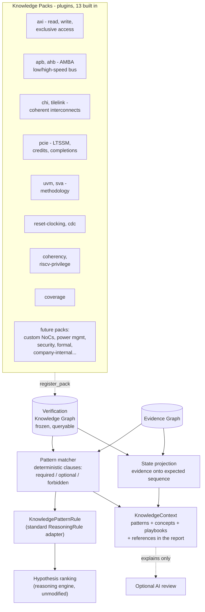

# The Verification Knowledge Engine

Milestone 5 gives VeriTriage domain expertise. Instead of relying on
whatever a language model happens to know about a protocol, the platform
carries its own structured, versioned verification knowledge: concepts,
protocol signals, state machines, failure patterns, debug playbooks, and
specification references. Deterministic code matches that knowledge against
the Evidence Graph before any AI runs; the LLM becomes an explanation layer
over conclusions that already exist, never the source of technical truth.

The knowledge base ships with **42 packs, 92 deterministic failure
patterns, 90 debug playbooks, 90 concepts, and 15 protocol state machines**
(`veritriage knowledge` prints the current count), grown across four content
tiers after v1.0.0 with no change to the clause matcher, the Knowledge Graph,
reasoning, or the report: proof that the registry architecture scales on
content alone. Coverage spans six domains (interconnect, CPU/ISA, memory,
serial IO, coherency, methodology) and includes the full original milestone
list: AMBA AXI (read, write, and exclusive access), APB,
AHB, AMBA CHI, TileLink, PCI Express, UVM methodology, SystemVerilog
Assertions, reset sequencing, clock domain crossing, cache coherency, and
RISC-V privilege. Every pack carries real specification section numbers,
not placeholder text, and a schema-validation test
(`test_pack_schema_is_well_formed`) runs against every pack in the registry
so "detailed knowledge" is a machine-checked property, not a claim.

## Architecture



The reasoning engine is untouched: knowledge reaches ranking through the
same ``ReasoningRule`` interface every built-in rule uses, injected by the
pipeline. Architecture tests pin that ``reasoning/`` and ``rules/`` import
nothing from ``knowledge/``, and that ``knowledge/`` references no AI code.

## Why structured knowledge beats prompt engineering

Putting protocol expertise in a prompt has four failure modes that
structured knowledge eliminates:

* **Unverifiable.** "The model knows AXI" cannot be audited. A
  ``FailurePattern`` with explicit clauses can be read, reviewed, and
  version-controlled like RTL. When a match happens, the report shows which
  clause matched which evidence node.
* **Non-deterministic.** Prompted knowledge produces different analyses on
  different days. Pattern matching is a pure function: same graphs, same
  matches, same scores, forever (a test runs it twice and diffs).
* **Not extensible.** Teaching a prompt a new protocol means rewriting prose
  and re-validating everything the prompt already covered. Teaching
  VeriTriage a new protocol is a new pack module: schema-checked, testable
  in isolation, zero changes elsewhere. TileLink, CHI, PCIe, APB, AHB, CDC,
  cache coherency, and RISC-V privilege all landed this way after the
  original AXI/UVM pair.
* **Silently wrong.** An LLM asserting a plausible-but-wrong protocol rule
  is indistinguishable from a right one. A pack cites the specification
  section (AMBA AXI A3.2.1 for handshake stability, PCIe completion timeout
  in section 2.9, RISC-V trap delegation in section 3.1.8) so a human can
  check the knowledge itself.

The AI still adds value: it narrates, connects, and names missing evidence.
But every technical claim it explains was first established by parsers,
rules, history, or knowledge, all deterministic and all cited.

## How Knowledge Packs work

A pack is a versioned Pydantic bundle registered by a decorated factory:

```python
@register_pack
def tilelink_pack() -> KnowledgePack:
    return KnowledgePack(id="tilelink", version="1.0.0", domain="protocol", ...)
```

Everything in a pack is normalized schema (``knowledge/model.py``):

| Item | What it encodes |
|---|---|
| ``Concept`` | A verification idea with markers that detect it in evidence |
| ``ProtocolSignal`` | Named interface signals and their roles |
| ``StateMachine`` | The expected transaction sequence, state by state |
| ``FailurePattern`` | A known failure mode: required/optional/forbidden clauses, typical causes, ownership, suggested signals, confidence modifiers, references |
| ``DebugPlaybook`` | A fixed, ordered debug sequence (no AI anywhere) |
| ``Reference`` | Specification/guideline pointers, with a ``uri`` hook for external documentation systems |

Packs are storage; the **Verification Knowledge Graph** is the query
surface. It normalizes every pack into typed nodes and edges (pack CONTAINS
item, pattern SUGGESTS playbook, state FOLLOWS state) and answers questions
like ``expected_sequence("axi.read-lifecycle")`` or
``playbook_for(pattern_id)``. The graph model is frozen after build;
``fingerprint()`` lets tests prove reasoning never mutates it.

## The built-in pack catalog

Run ``veritriage knowledge`` for the live table (counts below as of this
writing; the table itself is generated from the registry, so it can never
drift out of date the way prose documentation does):

| Pack (`id`) | Domain | Concepts | Patterns | Playbooks | FSMs | Example failure patterns |
|---|---|---|---|---|---|---|
| AMBA AXI (`axi`) | protocol | 5 | 4 | 4 | 2 (read, write) | No response after accepted address; write response never returned; exclusive access never succeeds; VALID dropped before READY |
| AMBA APB (`apb`) | protocol | 2 | 2 | 2 | 1 | PREADY never asserted; PSLVERR ignored |
| AMBA AHB (`ahb`) | protocol | 2 | 2 | 2 | 1 | Bus frozen by HREADY held low; repeated RETRY loop |
| AMBA CHI (`chi`) | protocol | 3 | 3 | 3 | 1 | Link credit starvation; snoop never answered; RetryAck without PCrdGrant |
| TileLink (`tilelink`) | protocol | 2 | 2 | 2 | 1 | Grant never returned for Acquire; channel priority inversion |
| PCI Express (`pcie`) | protocol | 3 | 3 | 3 | 1 | LTSSM never reaches L0; completion timeout; flow-control credit starvation |
| UVM methodology (`uvm`) | methodology | 2 | 2 | 2 | 0 | Scoreboard mismatch after protocol success; phase timeout with stimulus incomplete |
| SystemVerilog Assertions (`sva`) | methodology | 2 | 1 | 1 | 0 | Assertion fires before the timeout that would have followed |
| Reset sequencing and clocking (`reset-clocking`) | clocking | 2 | 3 | 3 | 0 | Reset released before clock stable; unexpected X propagation; repeated evaluation loop |
| Clock Domain Crossing (`cdc`) | clocking | 2 | 2 | 2 | 0 | Signal crossed without synchronization; multi-bit crossing without gray coding |
| Cache coherency (`coherency`) | coherency | 2 | 2 | 2 | 1 | Illegal coherence state transition; read observes stale data after a coherent write |
| RISC-V Privilege (`riscv-privilege`) | architecture | 3 | 2 | 2 | 1 | Trap delegated to the wrong privilege mode; illegal CSR access not faulted |
| Functional coverage (`coverage`) | coverage | 1 | 2 | 2 | 0 | Coverage hole overlapping a failure; coverage hole in an otherwise passing regression |

Two packs are intentionally protocol-agnostic and complement the
protocol-specific ones: **SVA** teaches what an assertion failure's *shape*
implies (a fired assertion outranks a later timeout as the real evidence),
and **cache coherency** teaches MESI/MOESI legality independent of which
interconnect (CHI, a custom NoC) carries the coherence messages.

## Deterministic pattern matching

Patterns are written in **clauses**: case-insensitive regexes over
normalized evidence node descriptions, optionally narrowed by artifact type
or failure status. A pattern matches when every ``required`` clause hits at
least one node and no ``forbidden`` clause hits any; ``optional`` clauses
sharpen the score (0.7 base + 0.3 x optional fraction). Forbidden clauses
carry real reasoning weight: *scoreboard mismatch after protocol success*
requires a mismatch AND forbids any fired assertion, which is exactly the
distinction a senior engineer draws.

Because clauses speak the evidence vocabulary rather than any protocol's
signal names, patterns are reusable across protocols: *outstanding
transactions never retire* matches an AXI hang and a proprietary NoC hang
with the same clause set.

## State projection: where progress stopped

Packs may define protocol state machines. The matcher projects evidence
onto them: a state is reached when one of its markers matches a node, and
the projection reports the first expected stage never reached. For the AXI
read-timeout fixture the report shows:

```
Address issued -> Address accepted -> Outstanding -> [stopped before Response] -> Complete
```

with the evidence node IDs that witnessed each reached stage. Markers for
later stages are written as positive observations only ("rvalid asserted",
"response beat") so a message like "no RVALID seen" can never count as the
response arriving.

## How knowledge improves explainability

Every knowledge conclusion in the report is triple-grounded:

1. **Evidence**: each matched clause lists the node IDs that satisfied it,
   resolving to artifact file and line.
2. **Ranking**: the pattern's confidence modifiers appear by name in each
   hypothesis's confidence trace ("knowledge:axi.no-response-after-accept
   +0.12"), so "why did RTL bug reach 67%?" includes the knowledge term.
3. **Authority**: the pattern cites its specification section, so even the
   knowledge itself is checkable.

The report's Verification Knowledge section then reads like a senior
engineer's review: the named failure mode, who usually owns it, its typical
causes, the signals to pull up, the deterministic playbook to follow, and
where in the expected protocol sequence progress stopped.

## Adding a protocol pack (checklist)

1. New module with an ``@register_pack`` factory returning a
   ``KnowledgePack`` (any location; built-ins live in ``knowledge/packs/``).
2. Encode concepts with detection markers, the transaction state machine(s),
   the failure patterns with clauses/causes/ownership/modifiers/references,
   and one playbook per failure class.
3. Add fixture-driven tests for the patterns you expect to fire.

Nothing else changes: not the matcher, not the reasoning engine, not the
report, not the AI layer. This door is already proven open eleven times
over (AXI, APB, AHB, CHI, TileLink, PCIe, UVM, SVA, reset/clocking, CDC,
coherency, RISC-V privilege all landed without a single change outside
their own pack module). What is still genuinely future work: additional
ARM protocol variants (ACE, AXI-Stream), power management (UPF-aware
sequencing), security verification, performance verification, formal
verification result ingestion, and company-internal protocols, all landing
through the identical checklist.

## Boundary tests

``tests/test_knowledge.py`` pins the milestone's guarantees:

* Knowledge packs and the matcher reference no AI code.
* The full pipeline (knowledge included) executes with AI disabled.
* Matching, projection, and playbooks are reproducible run over run.
* The Knowledge Graph fingerprint is unchanged by reasoning, and the model
  is frozen.
* ``reasoning/`` and ``rules/`` contain no knowledge imports.
* A custom pack registered at test time matches, contributes a signal, and
  unregisters cleanly.
* Every pack in the registry is schema-validated: regexes compile,
  confidence-modifier keys name real hypothesis categories, every pattern
  cites at least one reference, every playbook step has a real action, and
  pattern/concept/playbook IDs are unique both within and across packs.
* Eleven of the thirteen packs are proven against a realistic fixture log
  each (`test_pack_pattern_matches_realistic_evidence`), not just checked
  for schema validity: the pattern must actually fire, resolve its
  playbook, and reach the reasoning engine as a cited signal. AXI and UVM
  are covered by the Milestone 3/4 fixture set already exercised elsewhere
  in the suite.
