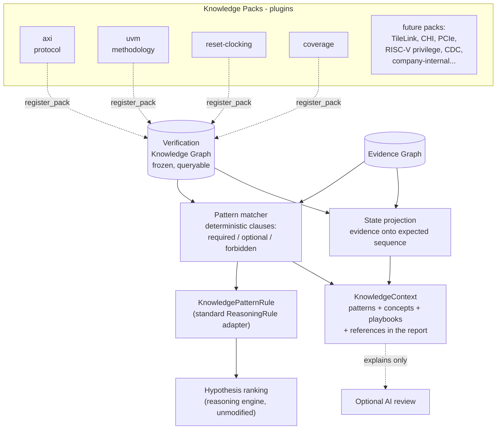

# The Verification Knowledge Engine

Milestone 5 gives VeriTriage domain expertise. Instead of relying on
whatever a language model happens to know about AXI or UVM, the platform
carries its own structured, versioned verification knowledge: concepts,
protocol signals, state machines, failure patterns, debug playbooks, and
specification references. Deterministic code matches that knowledge against
the Evidence Graph before any AI runs; the LLM becomes an explanation layer
over conclusions that already exist, never the source of technical truth.

## Architecture



The reasoning engine is untouched: knowledge reaches ranking through the
same ``ReasoningRule`` interface every built-in rule uses, injected by the
pipeline. Architecture tests pin that ``reasoning/`` and ``rules/`` import
nothing from ``knowledge/``, and that ``knowledge/`` references no AI code.

## Why structured knowledge beats prompt engineering

Putting protocol expertise in a prompt has four failure modes that
structured knowledge eliminates:

* **Unverifiable.** "The model knows AXI" cannot be audited. A
  ``FailurePattern`` with explicit clauses can be read, reviewed, and
  version-controlled like RTL. When a match happens, the report shows which
  clause matched which evidence node.
* **Non-deterministic.** Prompted knowledge produces different analyses on
  different days. Pattern matching is a pure function: same graphs, same
  matches, same scores, forever (a test runs it twice and diffs).
* **Not extensible.** Teaching a prompt TileLink means rewriting prose and
  re-validating everything. Teaching VeriTriage TileLink is a new pack
  module: schema-checked, testable in isolation, zero changes elsewhere.
* **Silently wrong.** An LLM asserting a plausible-but-wrong protocol rule
  is indistinguishable from a right one. A pack cites the specification
  section (AMBA AXI A3.2.1 for handshake stability) so a human can check
  the knowledge itself.

The AI still adds value: it narrates, connects, and names missing evidence.
But every technical claim it explains was first established by parsers,
rules, history, or knowledge, all deterministic and all cited.

## How Knowledge Packs work

A pack is a versioned Pydantic bundle registered by a decorated factory:

```python
@register_pack
def tilelink_pack() -> KnowledgePack:
    return KnowledgePack(id="tilelink", version="1.0.0", domain="protocol", ...)
```

Everything in a pack is normalized schema (``knowledge/model.py``):

| Item | What it encodes |
|---|---|
| ``Concept`` | A verification idea with markers that detect it in evidence |
| ``ProtocolSignal`` | Named interface signals and their roles |
| ``StateMachine`` | The expected transaction sequence, state by state |
| ``FailurePattern`` | A known failure mode: required/optional/forbidden clauses, typical causes, ownership, suggested signals, confidence modifiers, references |
| ``DebugPlaybook`` | A fixed, ordered debug sequence (no AI anywhere) |
| ``Reference`` | Specification/guideline pointers, with a ``uri`` hook for external documentation systems |

Packs are storage; the **Verification Knowledge Graph** is the query
surface. It normalizes every pack into typed nodes and edges (pack CONTAINS
item, pattern SUGGESTS playbook, state FOLLOWS state) and answers questions
like ``expected_sequence("axi.read-lifecycle")`` or
``playbook_for(pattern_id)``. The graph model is frozen after build;
``fingerprint()`` lets tests prove reasoning never mutates it.

## Deterministic pattern matching

Patterns are written in **clauses**: case-insensitive regexes over
normalized evidence node descriptions, optionally narrowed by artifact type
or failure status. A pattern matches when every ``required`` clause hits at
least one node and no ``forbidden`` clause hits any; ``optional`` clauses
sharpen the score (0.7 base + 0.3 x optional fraction). Forbidden clauses
carry real reasoning weight: *scoreboard mismatch after protocol success*
requires a mismatch AND forbids any fired assertion, which is exactly the
distinction a senior engineer draws.

Because clauses speak the evidence vocabulary rather than any protocol's
signal names, patterns are reusable across protocols: *outstanding
transactions never retire* matches an AXI hang and a proprietary NoC hang
with the same clause set.

## State projection: where progress stopped

Packs may define protocol state machines. The matcher projects evidence
onto them: a state is reached when one of its markers matches a node, and
the projection reports the first expected stage never reached. For the AXI
read-timeout fixture the report shows:

```
Address issued -> Address accepted -> Outstanding -> [stopped before Response] -> Complete
```

with the evidence node IDs that witnessed each reached stage. Markers for
later stages are written as positive observations only ("rvalid asserted",
"response beat") so a message like "no RVALID seen" can never count as the
response arriving.

## How knowledge improves explainability

Every knowledge conclusion in the report is triple-grounded:

1. **Evidence**: each matched clause lists the node IDs that satisfied it,
   resolving to artifact file and line.
2. **Ranking**: the pattern's confidence modifiers appear by name in each
   hypothesis's confidence trace ("knowledge:axi.no-response-after-accept
   +0.12"), so "why did RTL bug reach 67%?" includes the knowledge term.
3. **Authority**: the pattern cites its specification section, so even the
   knowledge itself is checkable.

The report's Verification Knowledge section then reads like a senior
engineer's review: the named failure mode, who usually owns it, its typical
causes, the signals to pull up, the deterministic playbook to follow, and
where in the expected protocol sequence progress stopped.

## Adding a protocol pack (checklist)

1. New module with an ``@register_pack`` factory returning a
   ``KnowledgePack`` (any location; built-ins live in ``knowledge/packs/``).
2. Encode concepts with detection markers, the transaction state machine(s),
   the failure patterns with clauses/causes/ownership/modifiers/references,
   and one playbook per failure class.
3. Add fixture-driven tests for the patterns you expect to fire.

Nothing else changes: not the matcher, not the reasoning engine, not the
report, not the AI layer. ARM protocol families, RISC-V privilege, custom
NoCs, cache coherency, power management, security, performance, and formal
domains all land through this same door.

## Boundary tests

``tests/test_knowledge.py`` pins the milestone's guarantees:

* Knowledge packs and the matcher reference no AI code.
* The full pipeline (knowledge included) executes with AI disabled.
* Matching, projection, and playbooks are reproducible run over run.
* The Knowledge Graph fingerprint is unchanged by reasoning, and the model
  is frozen.
* ``reasoning/`` and ``rules/`` contain no knowledge imports.
* A custom pack registered at test time matches, contributes a signal, and
  unregisters cleanly.
