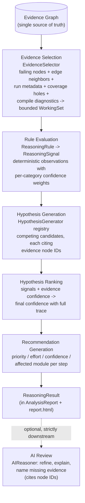

# The Verification Reasoning Engine

Milestone 3 turns VeriTriage from an evidence collector into a verification
reasoning platform: given an Evidence Graph, it produces multiple ranked,
evidence-backed hypotheses, traceable confidence, categorized engineering
recommendations, and (optionally) an AI review, without reading a single raw
log file. This document explains the pipeline, the design decisions behind
it, and how to extend it.

## The pipeline



Every stage is a pure, injectable component (`veritriage/reasoning/`):
selection, signals, generation, ranking, and recommendation each run
standalone on constructed inputs, and `tests/test_reasoning.py` exercises
them independently. The engine only sequences the stages.

## Why evidence-first reasoning beats log-first AI

A log-first AI system hands raw text to a model and hopes. That fails in
predictable ways:

* **Unverifiable output.** When the input is a thousand log lines, a claim
  like "the scoreboard mispredicted" cannot be mechanically traced to its
  source; hallucinated signals and times look identical to real ones.
* **No determinism.** Two runs over the same log can tell different stories;
  regression triage needs the same inputs to produce the same verdicts.
* **No composition.** Logs, coverage, and metadata live in different formats;
  a prompt full of concatenated files forces the model to re-do parsing,
  the least reliable place to do it.
* **Unbounded cost.** Raw logs are huge; normalized evidence is small.

Evidence-first reasoning inverts this. Deterministic parsers reduce every
artifact to typed nodes and relationships; deterministic rules and generators
build the candidate explanations; the model, when used at all, receives a
bounded, normalized working set where every atom has an ID pointing back to
a file and line. The AI's statements are auditable because it can only speak
in references to things that exist.

## How deterministic rules and AI collaborate

The division of labor is strict and layered:

| Layer | Produces | May it conclude? |
|---|---|---|
| Reasoning rules | Signals: cited observations with ranking weights | Never; signals only shift ranking |
| Hypothesis generators | Competing candidates with evidence | Only candidates, never a sole answer |
| Ranker | Ordered hypotheses with confidence traces | The deterministic verdict |
| Recommendation engine | Categorized next steps | Deterministic, derived from ranking |
| AI review (optional) | Refinement notes, narrative, missing evidence | Never; it annotates, it cannot re-rank |

The AI receives the deterministic stages' complete output (selected evidence,
signals, hypotheses, recommendations) so it refines rather than re-derives.
Its structured output is attached alongside the deterministic result: it
cannot alter the working set, the signals, the ranking, or the
recommendations. Remove the AI and the platform still produces its full
verdict; add it and you gain explanation quality, not different facts.

Example of a rule at work (the milestone's canonical case): the
`timeout-deadlock` rule observes *timeout + no protocol violation* (and, when
present, *transactions still in flight*) and emits a signal weighting
`rtl_bug` upward: forward progress stopped without a detected protocol
violation, which fits a design-side deadlock more than a checking error. The
rule never says "this is an RTL bug"; it makes the RTL hypothesis rank
higher, with the observation recorded in that hypothesis's confidence trace.

## Confidence propagation

Confidence flows upward through the pipeline and is traceable at every step:

```
parser confidence      (extraction certainty per evidence node)
  -> evidence factor   (mean confidence of a hypothesis's cited nodes)
rule confidence        (multiplier on each signal's weights)
  -> contributions     (signal weight x rule confidence, recorded per hypothesis)
hypothesis confidence  = clamp01(base + sum(contributions)) * evidence_factor
  -> recommendation confidence (propagated at 0.9x from the driving hypothesis)
```

Every hypothesis carries a `ConfidenceTrace`: the generator's base prior,
each signal contribution with its reason, the evidence factor, and the final
value. The HTML report renders the trace under each hypothesis, so "why 47%?"
is answerable line by line. `tests/test_reasoning.py` pins the arithmetic.

## Explainability contract

Every report answers, in order:

1. **What happened?** The classification and the run summary.
2. **Why do we believe this?** The signals that fired, each with evidence.
3. **Which evidence supports it?** Node IDs on every hypothesis, signal, and
   recommendation, resolving to artifact file + line via the graph.
4. **What alternatives exist?** All ranked hypotheses are shown, not just the
   winner, with their own evidence and traces.
5. **What should the engineer inspect next?** Recommendations categorized by
   priority, expected effort, confidence, and affected module.

No stage can output a conclusion without evidence: generators abstain when
they cannot cite nodes, and `tests/test_ai_boundary.py` +
`tests/test_reasoning.py` enforce it.

## The AI boundary (restated for this milestone)

`AIReasoner.review(graph, result)` receives exactly four things: the selected
evidence (the working set's graph view), the selection reasons, the signals,
and the hypotheses/recommendations. `build_ai_payload()` is a standalone
function so tests can pin what crosses the boundary: no raw artifact lines,
no nodes outside the working set, no file paths opened. Architecture tests
assert the module contains no file-reading calls and that the payload never
contains raw log text.

## Extending the reasoning engine

All extension points are additive; no existing reasoning code changes.

| Addition | How |
|---|---|
| New reasoning rule | Subclass `ReasoningRule`, emit a signal with weights + evidence, add to `default_reasoning_rules()` |
| New hypothesis class | Subclass `HypothesisGenerator`, decorate with `@register_generator` |
| Protocol-specific reasoning (AXI, TileLink, APB, CHI) | A rule pack: protocol rules observing protocol-tagged evidence nodes |
| Waveform metadata reasoning | The waveform parser emits `waveform_metadata` nodes; rules/generators read them like any node |
| Coverage / specification reasoning | Same: new node types + rules; the selector, ranker, recommender, and AI are untouched |
| Git commit correlation / regression history | New evidence nodes + a correlation pass; e.g. a rule boosting `rtl_bug` when a recent commit touched the failing scope |
| Similarity search | A selector enhancement (retrieve similar past working sets); downstream stages unchanged |

This works because every stage speaks only the node/edge/signal/hypothesis
vocabulary. New evidence types are new nodes; new expertise is new rules and
generators. Nothing re-reads files, and nothing needs the AI layer to change:
the same property the Evidence Graph guaranteed in Milestone 2, extended
through the whole reasoning stack.
