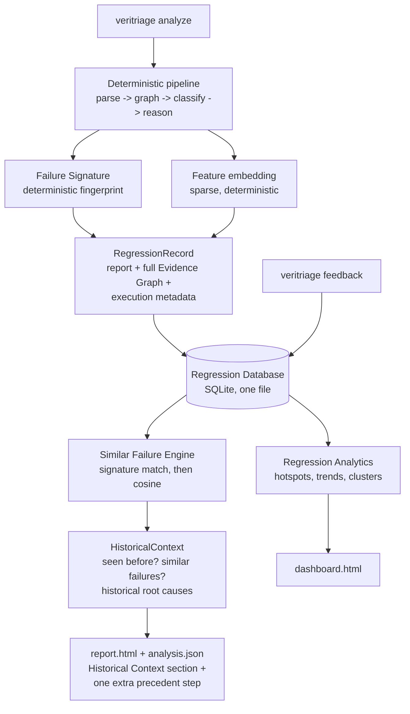

# Regression Intelligence

Milestone 4 gives VeriTriage a memory. Instead of treating every regression
as an isolated event, the platform stores each completed analysis in a
persistent Regression Database and uses that history to answer questions no
single run can:

* Have we seen this before?
* What usually causes failures like this?
* Which modules fail most often?
* Are failures increasing?
* Is this regression actually new?

The historical layer is strictly additive: the Reasoning Engine of
Milestone 3 is untouched (an architecture test enforces that no reasoning or
rules source imports any regression-intelligence package). History augments
reasoning; it never replaces it.

## The data flow

## Why historical learning matters

A verification team's most expensive debugging resource is repetition: the
same scoreboard bug filed twice, the same infrastructure flake chased by two
engineers a month apart, the same assertion firing across three tests with
three separate investigations. The regression database converts every
completed analysis into a reusable asset. The second time a failure mode
appears, the platform says so immediately, points at the previous
occurrence, and surfaces what (if anything) an engineer recorded as the
actual root cause. The platform gets smarter after every regression without
retraining anything: improvement is accumulated evidence, not model weights.

## Why deterministic signatures exist

Before any similarity math, VeriTriage computes a **Failure Signature**: a
stable fingerprint built from the failure category, the failing assertion
names, the affected modules, the reasoning signals that fired, the
hypothesis mix, and the classifying rule. Everything volatile is excluded on
purpose: timestamps, seeds, line numbers, node IDs, and confidence values
all differ between runs of the same underlying bug.

Signatures give three things embeddings cannot:

1. **Certainty.** An identical signature *is* the same failure mode by
   construction; "seen 4 times before" is an exact SQL count, not a score.
2. **Speed.** Signature lookup is an indexed equality query; it runs before
   any vector comparison and usually answers the question alone.
3. **Explainability.** A signature match can be printed field by field;
   there is no "the embedding said so."

## How similarity search works

When signatures do not match exactly, the Similar Failure Engine falls back
to semantic similarity over **normalized evidence, never raw text**. Every
record carries a sparse feature embedding built from its signature fields
plus the graph's relationship shape, with weights reflecting how much each
feature family says about failure identity (category 3.0, assertions 2.5,
modules 2.0, signals 1.5, hypotheses 1.0, edge relations 0.5, test name
0.5), L2-normalized so cosine similarity is a dot product. Ranking is
deterministic: exact signature matches score 1.0 and always outrank
embedding matches; ties break to the newer regression.

Each result carries the historical regression's classification and its best
known root cause: the engineer-confirmed cause when feedback recorded one,
otherwise the top-ranked hypothesis of that run.

The embedding provider is an interface (`similarity.EmbeddingProvider`).
Swapping in a learned text-embedding model later changes one package;
signatures, storage, analytics, and the reasoning engine are untouched.

## How historical knowledge improves reasoning

The HistoryEngine runs strictly after the reasoning pipeline and augments
its output through the report's existing vocabulary:

* `report.history` carries the `HistoricalContext`: the new regression ID,
  the signature digest, whether the signature was seen before and how many
  times, and the ranked similar failures with their historical root causes.
* When a strong precedent exists (signature match, or similarity at or
  above 0.6), one extra `EngineeringRecommendation` is appended after the
  reasoning engine's own steps: compare against the named past regression
  and its diagnosed root cause. Its confidence is the similarity score
  discounted by 0.85, because precedent suggests rather than proves.

Nothing in the reasoning result is reordered, rewritten, or removed, and
the reasoning packages have no import path to history. Remove the database
and the platform behaves exactly like Milestone 3.

## How analytics help verification teams

`veritriage dashboard` renders the whole history as an engineering
analytics page (no JavaScript, self-contained, light/dark):

| Section | Question it answers |
|---|---|
| Stat tiles | How many runs, how many failures, how much is unexplained? |
| Recent regressions | What happened lately, at which commits? |
| Failure clusters | What are our recurring problem areas? |
| Most unstable modules | Which scope generates the most failures? |
| Assertion hotspots | Which checkers fire most often? |
| Failure types | What is the failure mix? |
| Reasoning signal frequency | Which deterministic rules actually fire (rule effectiveness)? |
| Classification confidence | How sure is the platform, distribution-wide? |
| Most repeated recommendations | What do we keep telling engineers to do? |
| Failure trend | Are failures increasing? |
| Regression heatmap | Module x failure-type concentration at a glance. |

Clustering is deterministic: regressions group by exact signature first,
then signature groups whose representative embeddings are close (cosine at
or above 0.7) merge via union-find. The same history always produces the
same clusters, so a cluster label can be cited in a bug report.

The unknown-failure percentage is a health metric for VeriTriage itself:
it measures how much of the failure population the deterministic rule set
cannot yet explain, which is exactly where the next parser or rule should
be added.

## The feedback loop (interfaces now, learning later)

`veritriage feedback <regression-id>` records engineer judgments: diagnosis
correct or incorrect, the actual root cause, and which recommendations
helped or wasted time. Milestone 4 deliberately implements the interfaces
and storage only; no learning runs. The contract is designed for online
improvement without model training:

* Confirmed root causes immediately replace hypothesis titles in similar-
  failure results (implemented today).
* Signatures whose regressions are repeatedly marked incorrect identify
  where a new rule or generator is needed (future).
* Per-recommendation votes give a future ranker labeled data for reweighting
  recommendation templates (future).

## Storage

The Regression Database is one SQLite file (default
`.veritriage/regressions.db`, override with `--db`), using only the Python
standard library. Records are stored as complete JSON blobs (report plus
full Evidence Graph, nothing summarized away) with the columns queries need
(signature, classification, timestamp) indexed alongside. `RegressionStore`
is the adapter seam: everything above it speaks records, so replacing SQLite
with a server database is a storage-layer change only.

## Extensibility

All future integrations land as adapters around the same record vocabulary,
with no change to the reasoning engine or the schema of what exists:

| Integration | Lands as |
|---|---|
| Git history | richer `ExecutionMetadata` + a correlation adapter (fix commits per regression) |
| Jira / issue trackers | an adapter linking regression IDs to tickets; feeds `root_cause` |
| Waveform metadata, coverage databases | new parsers -> richer graphs -> richer signatures automatically |
| Formal, emulation, CI systems | new artifact adapters producing records through the same store |
| Learned embeddings | an `EmbeddingProvider` implementation |

## Answering the milestone's questions

* **"Have we seen this failure before?"** Signature lookup; printed in the
  terminal summary, analysis.json, and the report's Historical Context.
* **"What is the most likely historical root cause?"** The best similar
  failure's feedback-confirmed cause, else its top hypothesis.
* **"Which module causes the highest number of failures?"** Dashboard: Most
  Unstable Modules and the heatmap.
* **"Which assertions fail most frequently?"** Dashboard: Assertion Hotspots.
* **"Are failures increasing?"** Dashboard: Failure Trend.

All of it computed from stored Evidence Graphs and reasoning outputs; no
raw log file is ever re-read, and no reasoning code was modified.
