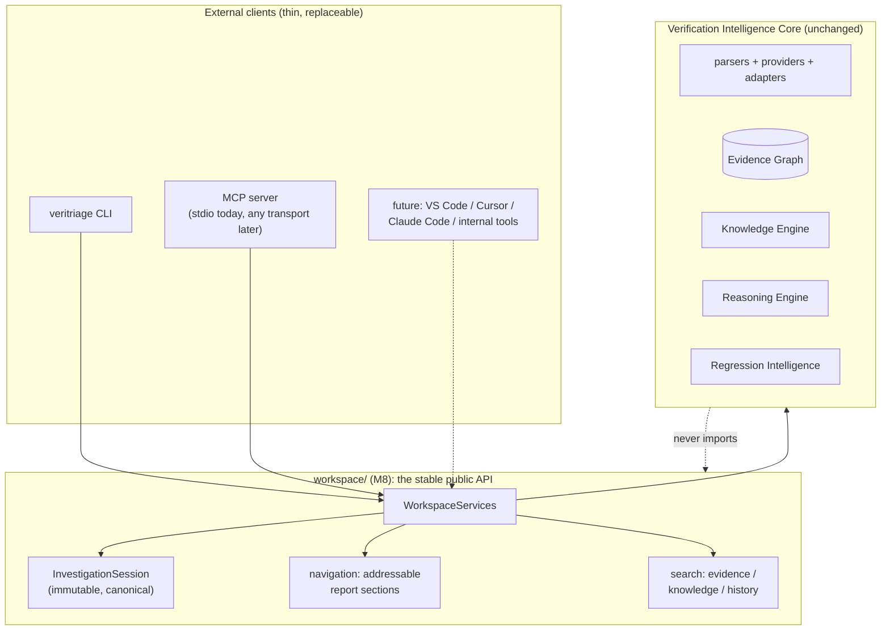

# Verification Workspace & MCP Platform (Milestone 8)

Status: IMPLEMENTED in v0.8.0. This began as the design contract for M8
(reviewed and approved before any Python was written) and is now the
milestone's permanent architecture doc. The design below matches what
shipped; the three review decisions (hand-rolled stdio transport, the
two-package consolidation, and the full CLI-as-client refactor) are folded
in throughout.

---

## 1. The one-sentence thesis

The Verification Intelligence Core is architecturally complete; Milestone 8
builds *around* it, not *into* it: a stable service layer wraps the core, an
immutable Investigation Session becomes the canonical exchange object, and an
MCP server plus the existing CLI become the first two peer clients of the same
services, so that IDEs, editors, and AI assistants (VS Code, Cursor, Claude
Code, internal tools) can query VeriTriage as an external investigation
service without embedding it and without any core change, ever.

## 2. Why the platform turns service-oriented now

Through M7, every milestone added intelligence: evidence, knowledge,
reasoning, history, waveform, engineering context. Each landed additively
through registries and rule interfaces, and the architecture tests that
accumulated along the way now pin the whole stack. That is what
"architecturally complete" means here: not that the core cannot grow packs,
adapters, or providers (it is designed to), but that its *shape* no longer
changes.

The remaining gap is access. Today the only consumers are the CLI and the
HTML report, and both reach directly into `pipeline.analyze()`. A VS Code
extension, an MCP host, or an internal dashboard would each have to re-invent
the same call patterns: run an analysis, hold onto the report and graph
together, look up one hypothesis, find similar history, search the knowledge
base. M8 extracts that call surface once, as a deliberate public API, and
then proves it is sufficient by making the CLI itself a client of it.



Dependencies point outward only: `workspace/` and `mcp/` import the core;
no core package may ever import them (architecture-test enforced).

## 3. Package layout (a deliberate consolidation of the spec's examples)

The milestone spec names `workspace/, services/, session/, api/, mcp/,
navigation/, search/` as example packages. Seven top-level packages for one
service layer would fragment cohesion, so M8 ships the same responsibilities
as **two** packages with one module per concern:

```
workspace/
  __init__.py       the public API surface (what "api/" would have been)
  session.py        InvestigationSession (frozen) + deterministic session IDs
  persistence.py    save/load session bundles (one JSON file per session)
  services.py       WorkspaceServices: investigate, sessions, history, knowledge
  navigation.py     addressable report sections (one hypothesis, one pattern...)
  search.py         deterministic search over evidence / knowledge / history
mcp/
  tools.py          transport-agnostic tool registry over WorkspaceServices
  server.py         minimal MCP stdio transport (JSON-RPC 2.0 loop)
```

Every capability the spec lists exists as a named module; only the directory
count differs. If a future milestone wants them split, the moves are
mechanical because nothing inside the core references any of it.

## 4. The Investigation Session (the canonical object)

```python
class InvestigationSession(BaseModel):
    model_config = ConfigDict(frozen=True)

    session_id: str            # deterministic content hash (see below)
    created_at: datetime
    input_files: tuple[str, ...]
    report: AnalysisReport     # carries classification, reasoning, knowledge,
                               # waveform, engineering, history: every layer
    graph: EvidenceGraph       # the full evidence, so clients never re-parse
    veritriage_version: str
```

* **It references everything the spec requires** because the v7 report
  already aggregates knowledge, waveform observations, historical matches,
  engineering context, and the generated-report content, and the graph
  carries the evidence itself. The session adds identity, provenance, and
  immutability on top; it invents no new data.
* **Immutable.** Frozen model; the architecture test asserts assignment
  raises. Clients navigate and project; nothing mutates a session after
  creation.
* **Deterministic identity.** `session_id = "ses-" + sha1(sorted node IDs,
  classification, input file names)[:12]`: the same investigation of the
  same artifacts is the same session, byte for byte, while `created_at`
  stays a separate provenance field so identity never depends on wall-clock.
* **Persisted as one JSON bundle** under `.veritriage/sessions/<id>.json`
  (beside the regression DB, same convention), so an MCP client can analyze
  in one tool call and drill down in later calls by `session_id` alone.

## 5. WorkspaceServices (the stable public API)

One class, deterministic, AI-free, storage-optional. Both the CLI and every
MCP tool call these methods and nothing else; investigation logic lives here
exactly once.

| Method | Wraps | Returns |
| --- | --- | --- |
| `investigate(paths, engineering=None)` | `pipeline.analyze()` | `InvestigationSession` |
| `save(session)` / `load(session_id)` / `list_sessions()` | persistence | sessions / summaries |
| `evidence(session, node_id=None, artifact_type=None, failing=None)` | graph queries | evidence views |
| `similar_regressions(session, db)` | signatures + similarity + store | `SimilarFailure` list |
| `search_knowledge(query)` | knowledge registry/graph | concepts, patterns, playbooks |
| `matched_patterns(session)` | report.knowledge | `MatchedPattern` list |
| `waveform_observations(session)` | report.waveform | observation views |
| `engineering_context(session)` | report.engineering | context view |
| `timeline(session)` | report.engineering.timeline | timeline events |
| `search(session, query)` | evidence text search | cited hits |
| `compare(a, b)` | signatures + classifications | deterministic diff summary |
| `summary(session)` | report | one bounded investigation summary |

Return types are exclusively models from `veritriage.models` plus the
session itself: **no `ParseResult`, no parser, adapter, or provider object
ever crosses the API** (architecture-test enforced by inspecting the service
class's signatures). Raw artifact paths go in; normalized objects come out.

## 6. Report Navigation API (`workspace/navigation.py`)

Every section of the HTML report becomes individually addressable without
regenerating anything, because every section is already a typed model on the
session:

| Address | Returns |
| --- | --- |
| `hypothesis(session, hypothesis_id)` | one `Hypothesis` with its trace |
| `recommendation(session, index)` | one `EngineeringRecommendation` |
| `knowledge_pattern(session, pattern_id)` | one `MatchedPattern` + playbook |
| `waveform_observation(session, observation_id)` | one observation view |
| `engineering_commit(session, revision)` | one commit view + correlations |
| `timeline_event(session, index)` | one timeline event |
| `similar_regression(session, regression_id)` | one historical match |
| `evidence_node(session, node_id)` | one evidence node + its edges |

Unknown IDs return None rather than raising, so clients can probe cheaply.
This is the exact lookup surface a VS Code extension needs to render a
tree view with lazy expansion: the extension becomes a thin client with no
VeriTriage logic of its own.

## 7. The MCP server

**Transport-agnostic by construction.** `mcp/tools.py` defines the tool
table: name, description, JSON-schema input, and a handler that calls
`WorkspaceServices` and returns JSON-serializable normalized data. That
table knows nothing about processes, sockets, or SDKs. `mcp/server.py` is
one thin stdio transport: a JSON-RPC 2.0 loop implementing the MCP subset a
host needs (`initialize`, `notifications/initialized`, `ping`,
`tools/list`, `tools/call`), reading line-delimited requests on stdin and
writing responses on stdout. A future official-SDK or HTTP hosting is
another thin file over the same table; no tool changes.

Zero new dependencies: the protocol subset is small, deterministic, and
fully testable in-process with fake streams. (If the official `mcp` Python
SDK is preferred as an optional extra instead, only `server.py` changes;
this is flagged as a review question.)

v1 tool set (each consumes session IDs and normalized objects only; none
touches a raw artifact beyond handing paths to `investigate`):

| Tool | Backing service |
| --- | --- |
| `analyze_regression(paths, context_root?)` | `investigate` + `save`; returns summary + session_id |
| `get_investigation_summary(session_id)` | `summary` |
| `get_evidence_graph(session_id, max_nodes?)` | bounded graph view |
| `get_hypothesis(session_id, hypothesis_id)` | navigation |
| `find_similar_regressions(session_id)` | `similar_regressions` |
| `search_knowledge(query)` | `search_knowledge` |
| `list_matched_patterns(session_id)` | `matched_patterns` |
| `search_playbooks(query)` | knowledge search, playbook slice |
| `get_waveform_observations(session_id)` | `waveform_observations` |
| `get_engineering_context(session_id)` | `engineering_context` |
| `get_timeline(session_id)` | `timeline` |
| `search_evidence(session_id, query)` | `search` |

CLI gains `veritriage mcp` (serve on stdio) and `veritriage sessions`
(list persisted sessions). And the existing `analyze` / `investigate` /
`impact` commands are refactored to call `WorkspaceServices`: **the CLI
stops importing `pipeline` directly and becomes client number one**, which
is the strongest possible proof the public API is sufficient.

## 8. VS Code readiness (build nothing, expose everything)

No extension ships in M8. Readiness means: an extension author needs only
(a) `analyze_regression` or a loaded session, (b) the navigation getters for
lazy tree rendering, (c) `search`/`similar`/`knowledge` for palettes, and
(d) the session bundle format for offline viewing. All four exist after M8
through either import (`veritriage.workspace`) or MCP. The eventual
extension is a rendering shell.

## 9. Testing

Unit: session identity determinism; persistence round-trip; every service
method against fixture sessions; every navigation getter (hit and miss);
search; compare; each MCP tool handler; the stdio loop end-to-end in-process
(initialize, list, call, error paths).

Architecture guards:

* `test_cli_and_mcp_share_services`: `cli/main.py` and `mcp/` import
  `veritriage.workspace`, and neither imports `veritriage.pipeline` or any
  parser/provider module directly;
* `test_sessions_are_immutable`: assignment on a session raises;
* `test_public_api_never_exposes_raw_parser_objects`: no service or
  navigation annotation references `ParseResult`, `Parser`,
  `WaveformAdapter`, or `ContextProvider`;
* `test_no_engine_knows_workspace`: no core package (`graph`, `parsers`,
  `rules`, `reasoning`, `knowledge`, `waveform`, `engineering`, `history`,
  `signatures`, `similarity`, `storage`, `analytics`, `models`) imports
  `veritriage.workspace` or `veritriage.mcp`;
* `test_mcp_tools_route_through_services`: every registered tool handler
  resolves to a `WorkspaceServices` call, none to pipeline/parsers;
* **crown jewel, `test_new_endpoint_needs_only_a_tool`**: a throwaway MCP
  tool registered inside the test is served through the same dispatcher and
  answers from an existing session, with no change to reasoning or any
  other core module.

## 10. Out of scope for M8 (deliberately)

* The VS Code extension itself, and any UI.
* Network transports (HTTP/SSE hosting): the tool table is the seam; a
  transport is a future thin file.
* Multi-user or concurrent workspace state; sessions are files.
* AI anywhere in the service layer: the optional AI review stays where it
  is, behind the CLI flag, outside `workspace/`.
* Session migration tooling (bundles carry `veritriage_version`; migration
  becomes relevant only after a breaking model change).

## 11. Success criteria (from the milestone spec, as tests)

VeriTriage operates as a reusable investigation platform: the CLI is one
client, the MCP server is another, both proven against the same
`WorkspaceServices` by import-level architecture tests; sessions are the
immutable canonical exchange object; every report section is addressable
without regeneration; and a new endpoint, client, or integration requires
zero changes to the Verification Intelligence Core, proven executably by the
crown-jewel tool test and the no-engine-knows-workspace guard. From here,
future work is integrations and ecosystem adoption, not core expansion.
